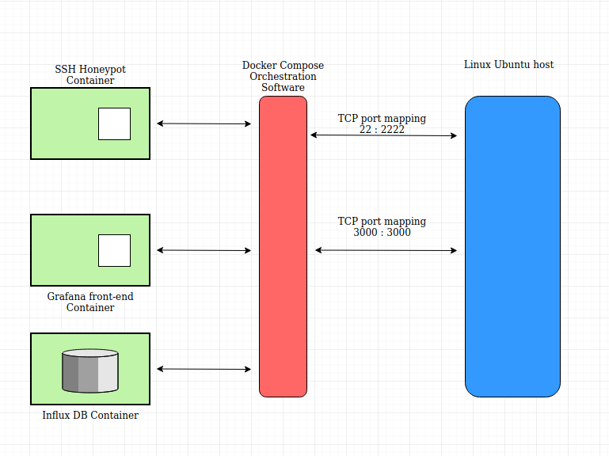
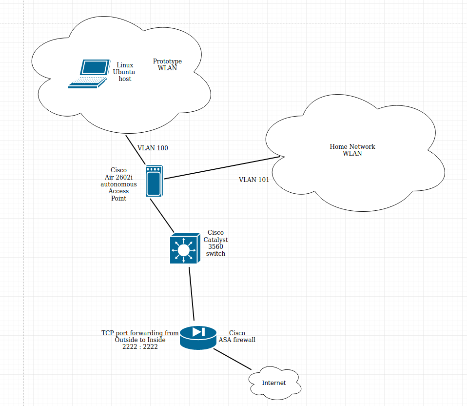

# SSH Honeypot as a source of  geolocation intelligence

#### By Alakbar Mammadov

## Submitted in partial fulfilment of the requirements for the degree BACHELOR in DIGITAL FORENSICS in the FACULTY OF APPLIED COMPUTING AND TECHNOLOGY of Noroff University College

#### Supervisor: Ruan Koen

#### Co-supervisor: Prof. Johan van Niekerk

#### April 2020

Herewith I would like to express my sincerest appreciation and gratitude to my family, friends and teachers 
for their support and help.

## Table of Contents

### List of Figures................................................................v

### List of Tables.................................................................vi

### Abstract......................................................................vii

### Chapter 1: Introduction..............................................................

#### 1.1 Background................................................................

#### 1.2 Problem Statement..............................................................

#### 1.3 Research Objectives..............................................................

#### 1.4 Methodology..............................................................

#### 1.4.1 Literature Survey..............................................................

#### 1.4.2 Prototyping..............................................................

#### 1.5 Delineation and Scope..............................................................

#### 1.6 Chapter Outline..............................................................

#### 1.7 Conclusion..............................................................

#### Chapter 2: Literature review..............................................................

#### 2.1 Introduction..............................................................

#### 2.2 Honeypots..............................................................

#### 2.3 Network security..............................................................

#### 2.4 Automation with docker..............................................................

#### 2.5 Container orchestration solutions..............................................................

#### 2.6 Automation with Python and bash scripting..............................................................

#### 2.7 Data visualisation..............................................................

#### 2.8 Conclusion..............................................................

#### Chapter 3: Prototyping..............................................................

#### 3.1 Introduction..............................................................

#### 3.2 Lab environment and toolset..............................................................

#### 3.2.3 Justification of toolset chosen..............................................................

#### 3.3 Prototype architecture..............................................................

#### 3.3.1 Logical overlay..............................................................

#### 3.3.2 Hardware and software requirements..............................................................

#### 3.4 Deployed infrastructure..............................................................

#### 3.4.1 Technologies employed..............................................................

#### 3.4.2 Components..............................................................

#### 3.5 Conclusion..............................................................

#### Chapter 4: Solution..............................................................

#### 4.1 Introduction..............................................................

#### 4.2 Results of running the solution..............................................................

#### 4.2.1 Outcome and its correlation with expected results..............................................................

#### 4.3 Experienced problems and lessons learned..............................................................

#### 4.4 Conclusion..............................................................

#### Chapter 5: Conclusion..............................................................

#### 5.1 Introduction..............................................................

#### 5.2 Summary of Findings..............................................................

#### 5.3 Accomplishment of Objectives..............................................................

#### 5.3.1 Primary Objective..............................................................

#### 5.3.2 Sub-Objectives..............................................................

#### 5.4 Conclusions..............................................................

#### 5.5 Suggestions for Future Research..............................................................

#### Reference List..............................................................

#### Appendix A –NAME..............................................................

####  List of Figures..............................................................

####  No table of figures entries found.

#### List of Tables..............................................................

#### No table of figures entries found.

#### Abstract

### Chapter 1: Introduction

The  

### Background

This 

### Problem Statement

### Research Objectives

Propose


### Methodology

### 1.4.1 Literature Survey

In

### 1.4.2 Prototyping

In

### 1.6 Delineation and Scope

This

### 1.7 Chapter Outline 

The

### 1.6 Conclusion

This

### Chapter 2: Literature review

#### 2.1 Introduction

This literature review will present related research from previous years with focus on particular technologies utilized in the current thesis. With technologies evolving very rapidly new research should take previous work further, using their strong and the most relevant sides. Current literature review covers research papers and books on various technologies such as Docker containers, Grafana data visualization solution, honeypots, concepts of network security and automation with scripting and programming. Bringing all these technologies together in one single solution makes it robust, efficient and highly modularized, enabling future researchers to add and remove components without unintentionally affecting other components.

#### 2.2 Honeypots

Baykara and Das (2015) propose to combine honeypot with Intrusion Detection System and Intrusion Prevention System in order to address “0 day” attacks. To the day IDS/IPS systems utilize different approaches to address security issues. Misuse detection is a method of distinguishing healthy behavior from the one, falling out of set predefined rules. Although, being highly effective and focused this method has one main disadvantage - misuse cannot be detected if it is not predefined. Anomaly detection is another technique, where some baseline profile is constructed based on  expected behavior and applied to the solution. The strong side of this approach is the ability to catch attack without any preliminary knowledge. At the same time,  anomaly detection has much bigger trap surface which can be a disadvantage due to the amount of false alarms generated. Emphasizing a potential to produce an overwhelming amount of false positive alarms as the weakest part of any IDS/IPS solution, the authors suggest to combine them with honeypot systems, to reduce the amount of noise generated and to enable IDS/IPS to update signature databases in real-time, adapting against “0 day” security threats.

Honeypots solve one of the main weaknesses of IDS/IPS systems, providing valuable intelligence information about sources, techniques and tool-sets of attackers. By design, honeypots do not respond to attack, in a contrary mimicking production systems and encouraging attackers to take further actions and reveal as much information about themselves as it possible. Another important advantage of intelligence information provided by honeypots is their potential to be constructed in a way, revealing connection between various attackers and enabling investigators to group them by geography, methodology, tool-sets and techniques utilized. Honeypots combined with IDS/IPS systems have potential to significantly decrease the number of false positive alarms, because almost all traffic witnessed on honeypots is malicious. Depending on the interaction level of honeypot solution being low, middle and high the resulting information will differ by its type and value. Also, honeypot placement on the network will influence the content of intelligence information collected. At the same time, a hybrid of IDS/IPS and honeypot system can be difficult and expensive to implement and manage. Running both systems independently and using data produced by them would make more sense and could be much more cost-effective solution.

Kamboj and Rana (2013) developed Attack Data Collection system using mixed data from vulnerabilities based attack data collection and network intrusion detection systems. With honeypot systems defined as having no production value and no expected activities on, any traffic seen on honeypots by default classified as malicious. Although, not addressing any security issues, honeypots are a great source of valuable intelligence information, given that data collected from them is processed and analyzed. The authors utilized Virtual Box solution as a virtualization platform, Linux as guest OS and Dionaea gateway as a honeypot system. Attack Data Collection system uses basic services including SSH, FTP and HTTP to listen on standard ports and log all attempts to access these services. Attackers ip addresses are extracted from logs using shell and Perl scripts. Beside this, the solution developed uses multi-level detection mechanisms including capture and analysis of network data and network Intrusion Detection based attack data collection. 

Overall aim is to achieve successful correlation of network attack data with OS level attack data. The system classifies events by their destination port numbers, distributes them by timestamps, protocols and according to the methods utilized by attackers. The solution generates tables, charts and graphs using Perl scripts and according to queries formulated by its user. Attack Data Collection system is constructed from various Open Source solutions, collected in one single solution addressing the main issue of intelligence data collection. The main drawback of the system its complexity on configuration side and high level skill demand for researchers trying to reproduce or utilize it. Complexity of security solutions are not to decrease the value of intelligence produced by them but ease of use and operational convenience are important factors influencing their prevalence.

Kim and Kim (2011) propose agent based honeypot solution to gather intelligence information. The framework developed contains honeynet elements, honeywall, management server and agents, installed on end-hosts. Agents create DecoyPorts on hosts or a mechanism to redirect suspicious traffic to honeypot. Considering the very nature of solution, any traffic registered on DecoyPort is treated as malicious. Agent software has additional functionality such as removing malicious processes created by worms. For this activity agent relies on manager server, containing database of worm signatures. Manager server controls agents and adjusts the load on the network by comparing the number of DecoyPorts with the number of ports opened by honeypots and making sure no orphaned listeners are left on the network. Honeywall is used to segregate honeypot network from production and ensure that intruder cannot access non-honeynet systems.

The proposed solution has its strong sides such as realtime suspicious activities check, centralized management server and segregation of honeynet and production networks using honeywall. At the same time it has dependency on local agents and as a result on utilization of resources on user-end hosts and capabilities of management server identify malicious code. The latter one can be the main drawback and might result in unexpected behavior of the solution failing to identify an attack.  

Valli, Rabadia and Woodard (2015) elaborated on honeypot systems focusing on SSH service. Kippo software written in Python has been utilized for investigation across 2012-2015. The main aim of the project was to identify automated attacks using password lists. Kippo is Python based software emulating SSH service. It is medium interaction honeypot, also emulating artificious file system with artefacts such as .bash_history logilfe and even virtual /proc file system. It utilizes local MySQL database on each honeypot, communicating the data to centralized PostgreSQL database solution. In addition to aggregated database solution, Kippo has integrated ElasticSearch engine and Kibana frontend, enabling user to query databases and visualize various sets of data, create alerts and notifications triggered by anomalies and particular events. Kippo as medium interaction honeypot allows attacker to login and perform some actions such as downloading files. All the activities are logged and artifacts downloaded are stored in special sandbox for future examination. Also, it uses p0f passive fingerprinting utility to examine network traffic from malicious user and to determine her operating system and other crucial information. 

Kippo honeynet became a global intelligence network with active nodes in the US, Europe and Asia. Running for several years it has witnessed many important events, influencing security mechanism and tools being developed and implemented across the globe. Kippo was one of the first honeypots catching shift in client OS utilized by attackers in 2012-2015. If Linux Backtrack and Kali were the main (99%) host operating systems used by attackers before 2015, in a later period Putty SSH Windows client’s signature had grown to notable significance. Kippo has rich tools set and various capabilities crucial such as retrieving attack source geolocation intelligence. The solution is customizable and can be expanded to the will of the user. At the same time its operational overhead and resource intensive nature can be considered as main drawbacks. Running medium interaction honeypots imply strict security measures to be taken. Sandboxing, access from honeypot to Internet and considerations regarding attackers being able to login to the honeypot are all pieces of complex and resource demanding solution.  

#### 2.3 Network Security

Honeypots provide users with data intelligence and digital reconnaissance information. By design honeypots are built to interact with malicious users. Depending on the type of a honeypot utilized, the level of interaction varies from simple ICMP echo replies to real-time full interactive shell activities on the system exploited by the attacker. That implies a certain level of precaution and in some cases thoroughly thought and built defense mechanisms on the network segment, where the honeypot system resits. Network security best practices and components such as Intrusion Detection and Systems are common to be seen along with honeypot systems as a means of monitoring the activities of malicious users.  

Mairh, Barik, Verma and Jena (2011) surveyed honeypot in network security. The main goal of the paper is to provide an insight into the aspects of utilizing honeypots in hybrid infrastructures with IDS. Traditional network defense mechanisms such as firewalls and IDS are not sufficient in the modern networks. Together with honeypots they will provide better insight into threats and attacks, generating specific intelligence information contributing to better security. The main role of any honeypot is to be compromised in a controlled way in order to produce valuable reconnaissance data. IDS systems enriched with honeypot generated data, can significantly lower the rate of false positive alarms. Also, along with prevention and detection, security systems are expected to provide a response to threats. This capability heavily relies on understanding of attack vector and employed mechanisms. And the best way of drawing conclusions on these matters is by monitoring, watching and researching later on attacker’s actions, techniques and methods. High interaction level honeypots are especially valuable for this matter. They encourage malicious users to reveal their techniques, tricks and tools by providing an experience of production like system.

Next research…...

#### 2.4 Automation with docker

Current research requires a number of various components configured in one single infrastructure to build the lab environment and to prototype the solution. This goal could be achieved in many different ways involving different technologies, skill-set and techniques.  For the sake of usability by other users and relieving them from the complexities of configuration, it was decided  to develop an automated solution requiring minimum configuration on user end. There were 2 choices serving the purpose - use virtualization platform such as KVM or Virtual Box and virtual machine instances or deploy highly automated containerized infrastructure, using Docker and if necessary orchestration solution such as docker-compose. The literature review and general research on the matter showed undoubtable advantage of Docker containers over other virtualization solutions in terms of portability and reproducibility of research.

Cito, Ferme and Call (2016) conducted research on reproducibility in Software and Web engineering using Docker containers. Even well documented software solutions have a lot of dependencies, require internal knowledge and are based on some assumptions. Reproducing research is not always obvious task and in some cases might require significant effort and extensive knowledge on topics  not directly related to the research subject. Reproducibility of scientific research is an absolute necessity in order to achieve same or expected results. And it should not come to the cost of building the whole solution from scratch. 

Containerization as technology and particularly Docker is ideal for addressing this issue. It enables users to build and store images of pre-configured light-weight virtual machines, embedding all the required dependencies, configuration, code and entry data. Docker images are defined by Dockerfile, collection of variables gathered in one text file and to be fed to the engine in order to build, fetch and manipulate images otherwise. These text files are easily distributed and highly portable between different releases and versions of operating systems.

The authors worked out tutorial consisting of 4 parts - introduction to containers and reproducibility of research, Docker container basics, use case and challenges and limitations. The conclusion on the document is that there is a definite advantage of container technology over classic virtualization and implementation on physical machines. Although containerized software packages might require more planning and careful consideration on designing stage, advantages they provide in production stage outweigh any drawbacks.  

Felter, Ferreira, Rajamony and Rubio (2014) conducted comparative research of KVM based hypervisor virtualization and Docker containerization technologies. Assuming that Linux is the preferred platform for big scale virtualization scenarios, the research is focusing on Linux platforms. Conflicting requirements for system-wide configuration settings by multiple applications and shared library dependencies are thought to be the main motivation for isolation on OS level. To avoid unnecessary cost, administration overhead and hardware duplication virtualization systems came into play as the main means of resource isolation. With KVM and other type 1 hypervisor systems, the resource consumption on the host is bounded, mapping vCPU to real CPU (core) and vRAM page to one real page of physical RAM. Live migration, “hot-plugging” and scalability are important advantages of virtualization with hypervisors. At the same time there are some clear drawbacks of using hypervisor virtualization. To name a few - overhead of data sharing between guest systems or guest and hypervisor, expensive access operations through emulated block devices and known anomalies allowing guest OS to “break out” of its VM defined boundaries.

Containers technology allows to take advantage of kernel namespaces feature, providing an extra level of isolation for processes running on the same OS. Linux systems utilize various namespaces for user, network, hostname, filesystem, PID and IPC. Overall approach with containers  is to create container isolated from any objects outside of it. In fact, containers share the same underlying kernel with other containers running on the same OS. The cost of communication between containers and to the host is significantly less than with hypervisor virtualization due to the fact that containers are running on the same OS, using the same kernel, but utilizing parent/child kernel namespaces without need to run redundant management processes on each instance. Other advantages of container technology over hypervisor virtualization such as smaller footprint, smaller storage requirements, speed of deployment, portability and faster start up time due to the fact that containers do not boot another copy of OS, quickly made them tool of choice for scientific research and development environment.

Performance wise the authors after experiments and comparison came to the conclusion that containers are very close to native CPU performance while KVM is 22% slower. RAM performance for all three platforms - native bare-metal, container adn KVM is about the same. Network tests revealed the fact of containers being close to native performance if used without default internal NAT and adding about 30 ms latency through NAT. And storage performance with native and container setup showed almost identical results while KVM introduced significant overhead. The overall conclusion on the research is that container technology either matches or exceeds hypervisor based virtualization performance. Adding great flexibility, portability and rich set of features provided by management solutions like Docker, containers are to take over various areas dominated by classic virtualization solutions.

Boetigger (2014) emphasizes advantages of Docker containers for reproducible research over other virtualization platforms. Combination of cross-platform portability, modular elements, software versioning and ability to employ DevOps approach addresses many challenges faced by researchers. The author refers to the study at the University of Arizona, stating that less than half of software was successfully built and installed by researchers trying to replicate that study. Basic dependencies and relatively complex matters such as order of evaluation of the code contribute to difficulties in reproducing a study and its results. Another factor contributing to challenges is imprecise documentation, where solutions and software packages built by researchers with different level of skills and knowledge of underlying requirements result in sufficient level of details in documentation for some of them and lack of crucial information for others. Next issue to be addressed for better reproducibility of research is robustness of results to the changes in software components due to updates, new versions and releases.

A philosophy known as Development and Systems Operation or DevOps solves these problems by scripting and automation, rather than documenting all the necessary dependencies and components. Scripts, building and compiling all the necessary pieces use already existing and well-known tools which makes changes brought by DevOps more philosophical than technological. Linux containers and Docker management system are the best fit for addressing all the mentioned challenges, enabling users to script all the necessary steps and to provide highly automated and self-building environment. Additional features such as significantly lower demand on system resources and ability to concentrate all the building blocks and definitions of complex and very large images in a small basic text file called Dockerfile made this technology absolute winner in scientific, technological, engineering and other areas. Even changes to the dependencies such as updates, previously breaking code were resolved by Docker image versioning.  Docker also offers  free cloud backend such as Docker Hub at hub.docker.com providing Continuous Integration services, automated builds, online repository for images.

#### 2.5 Container orchestration solutions

Container technology is built on the idea of microservices and decoupling various solutions from each other in order to have better control over different parts of the executed software. It assumed that classical approach of bundling various pieces of software in one single package is counterproductive and creates a lot of problems for professionals debugging and troubleshooting it. Also, this approach is expensive hardware wise, resulting in unnecessary duplications and non-efficient resource utilization. So, it is rarely seen that containerized solution contains of one single container. Often times software solutions consists of multiple containers, running in one bundle, exchanging data and serving the purpose.

Multiple containers still can be run without any centralized management solution, but that would neglate overall idea of automation. During the last 5 years various management solutions, known as Container Orchestration Solutions have been developed and presented on the market. Some of them, like Docker Compose and Kubernetes received wide recognition and became part of different solutions running all over the globe.  

Docker-compose

Kubernetes

#### 2.6 Automation with Python and bash scripting

Infrastructure automation alone is one of the building blocks of the modern research concept. Every research aims to solve a particular problem. For this particular research large amounts of data in log files need to be parsed, formatted and processed. Problem of repetitive tasks in computing is addressed by employing scripting or programming. Bash shell scripting for solving relatively small tasks on Linux platforms and Python as a universal cross-platform programming and scripting language are considered as the best fit for the current and similar projects due to their flexibility, support ecosystem, mature documentation and broad user community.

Python

Bash

#### 2.7 Data visualisation

Professional data analysis implies comprehensive and structured reporting. Visualization front-end is an absolute necessity for large volumes of data in order to present it in a comprehensible format. Almost all modern programming languages offer modules for producing graphs, charts and tables as part of their standard libraries. There are also more sophisticated and well developed platforms solving the problem of data visualization. Wide variety of commercial and Open Source solutions are offering data visualization services.

Wang, Alexander & Wang (2015) review methods and technology progress on Big Data visualization, revealing the importance of representation of data in a systematic form. Data visualization helps with discoveries leading to improved management decisions, better collaboration, increased return of investment and time savings. Also, it enables user interactivity resulting in improved engagement. At the same time, overwhelming users with visuals are not necessarily going to lead to right decisions or certainty on the matter. As with many other technologies the approach taken with data representation and visualization is responsible for the end result. Development of Information Technology resulted in improved data visualization methods and techniques, added to conventional tables, diagrams, charts, etc. Computers enabled users to build interactive visualizations, which are of great importance in many industries. Proactive monitoring, live data streams, geodata, business analytics and many other types of data are crucial part of modern military and civil applications. Web application with database backend is the most common type of application of interactive data visualization. Value delivered by modern applications comes at the cost of careful planning and deep expertise on the technologies utilized. It is very easy to overwhelm a user with loads of data, most of which is noise. Also, performance of underlying infrastructure can be impacted in a negative way if data queried and plotted or visualized otherwise is miscalculated in volume. So, understanding the data analysed and addressing quality issues are the main challenges to be faced with.

Nurgaliyev, Aimar and Karavakis (2016) conducted comparative analysis on the 3 most popular analytics and visualization platforms - Kibana, Zeppelin and Grafana. All three solutions are open source platforms well recognized in the scientific community. Comparing to Grafana, Kibana has more features and options available. It is paired with Elasticsearch and Logstash solutions, working as a stack with extensive search and data objects storing capabilities. Kibana is scalable, highly-configurable and feature-rich system, having complex internal structure and enabling users to visualize various data types. Focused deeply on search capabilities it provides Lucene query syntax based query syntax, allowing for selected time frame based search, boolean operators, wildcards and field filtering. The search engine or Elasticsearch server accepts user built scripts and return the result of execution of these scripts in real time. Grafana visualization system is focused more on visualization itself, allowing for axes customization and data transformation sparing user’s time. Many other features of Grafana coming for free have to be obtained for Kibana as commercial plug-ins. The key difference between the two solutions is in their purpose. Kibana is built on top of Elasticsearch and fits perfectly for analyzing log data. Grafana is shaped for reading and visualizing metrics, such as I/O counters, network and system metrics. Grafana tends to be more tolerant towards working with multiple time-series datastore systems, such as InfluxDB, PostgreSQL, Elasticsearch and MySQL. Zeppelin is another visualization solution, or more precisely it is web-based notebook capable of interactive data analytics. One of the most powerful features of Zeppelin is its ability to share Zeppelin Notebook URL among multiple users and visualize changes in real-time for all the users following it.

#### 2.8 Conclusion

### Chapter 3: Prototyping

#### 3.1 Introduction

The research conducted is based on physical infrastructure consisting of LAN and WAN connections, server, firewall and switch. Building a prototype of the solution is necessary as a proof of concept and for working out practical issues of configuration and implementation. 

#### 3.2 Lab environment and toolset

The following hardware and software components are utilized for the prototype:
Cisco Catalyst 3560 48 port switch with IOS image c3560-advipservicesk9-mz.122-37.SE.bin
Cisco ASA 5510 firewall as a router and Internet gateway with system image asa915-k8.bin
Cisco 1142n Wireless Access Point with autonomous IOS image ap3g2-k9w7-xx.153-3.JF5
Lenovo ThinkPad X230 as a server and Docker host machine with Linux Ubuntu 16.04.6 LTS as OS, Docker version 19.03.1, build 74b1e89e8a and Python 3.5.2 and docker-compose version 1.12.0, build b31ff33

#### 3.2.1 Justification of toolset chosen

It was decided to build the infrastructure for the project, utilizing stable and proven hardware and software components, avoiding unexpected behavior on any level and minimizing potential for downtime. Cisco hardware and software components were chosen on the network side, due to the reputation, flexibility, ability to provide secure and highly configurable environment of these products. Aim to improve reproducibility and achieve minimization of configuration for the future researchers, led to the decision to use Docker containers for the honeypot solution. According to 2.4 Automation with docker, reproducibility is the main challenge for researchers trying to repeat or bring further existing research. This problem is addressed by implementing Docker as virtualization solution.

The solution consists of multiple containers, working in one bundle and exchanging data between each other. Certain scenarios require utilization of orchestration solution, to create a single point of management for all running instances. 2.5 Container orchestration solutions introduces Docker Compose and Kubernetes as orchestration options, with the former being preferred for research, labs and small environments and the latter being tool of choice for enterprise level deployments with complex infrastructure. Considering the scope, scale and nature of this work, it was decided to employ Docker Compose tool as orchestrator.

Docker virtualization is native to Linux platforms and performs best, deployed on Linux OS. Ubuntu 16.04.6 LTS is used as a server hosting Docker solution. Reliability, performance, small footprint and native kernel level support of Docker are the main factors contributing to the decision to use Linux as host operating system.  

#### 3.3 Prototype architecture

The prototype is running on the Research & Development network with stable Internet connection. Linux server hosts set of Docker containers running on top of it - main container running ssh honeypot, gathering login attempt information and dumping data of interest into Influx DB, container running Influx DB and container running Grafana frontend and responsible for all visualization routines.

TODO: add Dockerfile explanation - yaml, what instructions it contains and etc.

#### 3.3.1 Honeypot container

Container running SSH and Rsyslog daemons and gathering authentication attempt records in a log file is defined in Dockerfile with the following settings:

```
#Use an official Python runtime as a parent image
FROM ubuntu:latest
# Set the working directory to /app
WORKDIR /app
# Copy the current directory contents into the container at /app
ADD . /app
# Installing dependencies and required software
RUN apt-get update && apt-get install -y net-tools && apt-get install -y iputils-ping && apt-get install -y ssh && apt-get install -y vim && apt-get install -y rsyslog && apt-get install -y sqlite3 && apt-get install -y python3-pip && pip3 install influxdb
# Exposing port 2222 to outside networks
EXPOSE 2222
```

Dockerfile instructs daemon to use latest ubuntu image to fetch and build local image, acting as the main container. Next step is set /app directory as working directory on the container. Next instruction recursively adds all content of the current directory on host to the /app directory of new created container. After container is built, it is instructed to run a chain of commands, installing necessary updates and upgrades, tools and services. And the last step is to expose particular port on the container, making it available for further mapping to the port of choice on the physical host. 
Influx DB container and Grafana front-end container are bundled with honeypot solution and defined in docker-compose file as the following setup:

```
version: '3'
services:
    honeypot:
        build: .
        hostname: honeypot
        container_name: honeypot
        ports:
            - "2222:22"
        command: /bin/sh /app/hp_script.sh
```

Docker-compose file instructs Compose software to run multiple containers together with container “honeypot”. It maps port 2222 on host exposed via Dockerfile to port 22 in container. In the next step it runs “hp_script.sh” shell script with the following content:

```
# Start ssh service
service ssh start
# Enable port 22 for SSH daemon to listen
echo "Port 22" >> /etc/ssh/sshd_config
# Enable all address families ipv4 and ipv6
echo "AddressFamily any" >> /etc/ssh/sshd_config
# Listen for all ip addresses
echo "ListenAddress 0.0.0.0" >> /etc/ssh/sshd_config
# Enable SSH logging to /var/log/auth.log
echo "SyslogFacility AUTH" >> /etc/ssh/sshd_config
# Set logging level INFO
echo "LogLevel INFO" >> /etc/ssh/sshd_config
# Enable root account login on SSH daemon
echo "PermitRootLogin yes" >> /etc/ssh/sshd_config
# Set maximum authentication tries to 3 attempts
echo "MaxAuthTries 3" >> /etc/ssh/sshd_config
# Restart SSH daemon
service ssh restart
# Start Rsyslog daemon
service rsyslog start
# Set auth.log file location
LOGFILE=/var/log/auth.log
# Set output file for Python parser script ip_and_date_parser.py reading atuh.log file and fetching data of interest
OUTPUTFILE=/app/output.txt
# start infinite loop
while true
    do
        # if auth.log file exists
        if [ -e $LOGFILE ]; then
            # call Python parser script
            python3 ip_and_date_parser.py /var/log/auth.log
        else
        # otherwise print out in console
        echo "$LOGFILE does not exist"
        fi
    # wait 10 seconds
    sleep 10
    done
```

Python parser script has the following content with comments explaining its purpose:

```
# Import modules
import re
import sys
import time
# Set variables
iplist = {}
logfile = sys.argv[1]
outputfile = "/app/output.txt"
# Read and parse /var/log/auth.log file in container fetching timestamps and ip addresses attempting to login to SSH daemon
while True:
    with open(logfile, 'r') as f:
        for line in f:
            ip = (re.findall(r"\d{1,3}\.\d{1,3}\.\d{1,3}\.\d{1,3}", line))
            timestamp = line[0:15]
            iplist.update({str(timestamp):str(ip)[2:-2]})
        with open(outputfile, 'w') as o:
            o.write(str(iplist))
    time.sleep(10)
    continue
```

#### 3.3.2 Influx DB container

Python script reads and parses SSH authentication log, extracting timestamp and ip of hosts attempts are made from. Python solution creates dictionary and writes the data to Influx DB, running in database container. 
Database container defined in docker-compose with the following settings:

```
    db:
        image: influxdb
        hostname: influx
        container_name: influx
        env_file:
           - db-var.env
```

It uses environment variables defined in db-var.env and fed by docker-compose script. It creates "honeypot" DB and sets 
username and password for administrator.

```
INFLUXDB_DB=honeypot
INFLUXDB_ADMIN_USER=admin
INFLUXDB_ADMIN_PASSWORD=admin123
```

#### 3.3.2 Grafana front-end container

The last part of docker-compose.yaml file contains instructions relevant for building and running grafana container, mapping internal TCP port 3000 of container to TCP port 3000 of the host.

```
    web:
        image: grafana/grafana
        hostname: grafana
        container_name: grafana
        ports:
            - "3000:3000"
```

#### 3.3.1 Logical overlay

The logical overlay of containerized solution is shown on the scheme below:

The logical overlay of the whole prototype infrastructure including hardware elements is shown on the scheme below:


#### 3.3.2 Hardware and software requirements

#### 3.4 Technologies employed (e.g. docker, python, bash scripting, Grafana)

#### 3.5 Conclusion

Chapter

### Chapter 4: Solution

4.1 Introduction
Chapter
4.X Conclusion
Chapter

### Chapter 5: Conclusion

5.1 Introduction
The 
5.2 Summary of Findings
The 
5.3 Accomplishment of Objectives
5.3.1 Primary Objective
Propose     
5.3.2 Sub-Objectives
Explore 
5.4 Conclusions
qwerty
5.5 Suggestions for Future Research
qwerty


### Reference List
Baykara, M., & Das, R. (2015). “A Survey on honeypot technologies used in intrusion detection systems”. Proceedings of 16th ISERD International Conference, 2(November), 14–19. 

Kamboj, R., & Rana, V. (2013). Implementation of Attack Data Collection Incorporating Multi Level Detection Capabilities Using Low Interaction Honeypot. International Journal of Computer Science and Engineering, 2(4), 27–36. 

Valli, C., Rabadia, P., & Das, R. (2015). “A profile of prolonged, persistent SSH attack on a Kippo based honeynet”, Security Research Institute, Edith Cowan University, Australia. 

Cito, J., Ferme, V.  & Gall, H. (2016). Using Docker Containers to Improve Reproducibility in Software and Web Engineering Research. University of Zurich, Zurich, Switzerland, University of Lugano, Lugano, Switzerland.

Felter, W., Ferreira, A., Rajamony, R., & Rubio, J. (2015). An updated performance comparison of virtual machines and Linux containers.  IBM Research Report. ISPASS 2015 - IEEE International Symposium on Performance Analysis of Systems and Software, 25482, 171–172.

Boettiger, C. (2014). An introduction to Docker for reproducible research, with examples from the R environment. Center for Stock Assessment Research, Santa Cruz, USA.

Nurgaliyev, I., Karavakis, E. & Aimar, A. (2016). Kibana, Grafana and Zeppelin on Monitoring data. CERN openlab Summer Student Report.

Lidong Wang, Guanghui Wang, and Cheryl Ann Alexander (2015), “Big Data and Visualization: Methods, Challenges and Technology Progress.” Digital Technologies, Science & Education Publishing, vol. 1, no. 1 (2015): 33-38.

Mairh, A., Barik, D., Verma, K., & Jena, D. (2011). Honeypot in network security: A survey. ACM International Conference Proceeding Series, 600–605. Accessed on 10.11.2019, available via https://doi.org/10.1145/1947940.1948065 .


### Appendix A –NAME
ANY APPENDICES HERE
