## Table of Contents

- [Table of Contents](#table-of-contents)
- [List of Figures](#list-of-figures)
- [List of Tables](#list-of-tables)
- [Abstract](#abstract)
- [Chapter 1: Introduction](#chapter-1-introduction)
  - [1.1 Background](#11-background)
  - [1.2 Problem Statement](#12-problem-statement)
  - [1.3 Research objectives](#13-research-objectives)
  - [1.4 Research Approach](#14-research-approach)
    - [1.4.1 Literature Survey](#141-literature-survey)
    - [1.4.2 Prototyping](#142-prototyping)
  - [1.5 Delineation and scope](#15-delineation-and-scope)
  - [1.6 Study outline](#16-study-outline)
  - [1.7 Conclusion](#17-conclusion)
- [Chapter 2: Literature review](#chapter-2-literature-review)
  - [2.1 Introduction](#21-introduction)
    - [2.2 Combating Cyber Attacks through Intelligence](#22-combating-cyber-attacks-through-intelligence)
      - [Table 1. Threat Intelligence statistics 2019 by Symantec Security](#table-1-threat-intelligence-statistics-2019-by-symantec-security)
  - [2.3 Gathering Intelligence through Honeypots](#23-gathering-intelligence-through-honeypots)
  - [2.3.1 Honeypot systems combined with IDS and IPS](#231-honeypot-systems-combined-with-ids-and-ips)
    - [2.3.2 SSH Honeypot system](#232-ssh-honeypot-system)
  - [2.4 Approaches for automation of software solution](#24-approaches-for-automation-of-software-solution)
  - [2.4.1 Automation through Docker and Docker-compose](#241-automation-through-docker-and-docker-compose)
      - [Figure 2.1 KVM architecture (RedHat, 2019)](#figure-21-kvm-architecture-redhat-2019)
      - [Figure 2.2 Docker container architecture (Docker, 2019)](#figure-22-docker-container-architecture-docker-2019)
      - [Table 2. Comparing KVM and Docker containers](#table-2-comparing-kvm-and-docker-containers)
    - [2.4.2 Automation through Python and bash scripting](#242-automation-through-python-and-bash-scripting)
  - [2.5 Data Presentation](#25-data-presentation)
    - [2.5.1 Visualizing Threat Intelligence](#251-visualizing-threat-intelligence)
      - [2.5.1.1 Approaches](#2511-approaches)
        - [2.5.1.2 Existing visualization solutions with a look at the benefits and drawbacks](#2512-existing-visualization-solutions-with-a-look-at-the-benefits-and-drawbacks)
      - [Figure 2.3 Kibana GUI (ELK, 2019)](#figure-23-kibana-gui-elk-2019)
      - [Figure 2.4 Grafana GUI (Grafana, 2019)](#figure-24-grafana-gui-grafana-2019)
      - [Figure 2.5 Zeppelin GUI (Apache, 2019)](#figure-25-zeppelin-gui-apache-2019)
  - [2.6 Conclusion](#26-conclusion)
- [Chapter 3: Theoretical Honeypot Architecture](#chapter-3-theoretical-honeypot-architecture)
  - [3.1 Introduction](#31-introduction)
  - [3.2 Theoretical Architecture](#32-theoretical-architecture)
    - [3.2.1 Desired functionality](#321-desired-functionality)
      - [Figure 3.1 General workflow](#figure-31-general-workflow)
    - [3.2.2 Theoretical Honeypot Model](#322-theoretical-honeypot-model)
      - [Figure 3.2 Honeypot model](#figure-32-honeypot-model)
    - [3.2.3 Logical Network Model](#323-logical-network-model)
      - [Figure 3.3 Network Model](#figure-33-network-model)
    - [3.2.4 Theoretical architecture](#324-theoretical-architecture)
      - [Figure 3.4 Teoretical architecture](#figure-34-teoretical-architecture)
  - [3.3 SSH Honeypot: Proof of Concept Prototype](#33-ssh-honeypot-proof-of-concept-prototype)
    - [3.3.1 Step 1 - Defining SSH Honeypot container](#331-step-1---defining-ssh-honeypot-container)
    - [3.3.2 Step 2 - Running SSH honeypot container using Docker Compose](#332-step-2---running-ssh-honeypot-container-using-docker-compose)
    - [3.3.3 Step 3 - Defining and running Influx DB container  using Docker Compose](#333-step-3---defining-and-running-influx-db-container-using-docker-compose)
    - [3.3.4 Step 4 - Defining and running Grafana container  using Docker Compose](#334-step-4---defining-and-running-grafana-container-using-docker-compose)
    - [3.3.5 Configuring network firewall](#335-configuring-network-firewall)
    - [3.3.6 Operating the solution](#336-operating-the-solution)
  - [3.4 Conclusion](#34-conclusion)
- [Chapter 4: Solution](#chapter-4-solution)
  - [4.1 Introduction](#41-introduction)
  - [4.2 Proof of Concept Prototype](#42-proof-of-concept-prototype)
      - [Figure 4.1 Grafana login screen](#figure-41-grafana-login-screen)
      - [Figure 4.2 Add data source](#figure-42-add-data-source)
      - [Figure 4.3 Adding HoneypotDB as a source](#figure-43-adding-honeypotdb-as-a-source)
      - [Figure 4.4 Available visualization types](#figure-44-available-visualization-types)
  - [4.3 Data analysis](#43-data-analysis)
  - [4.3.1 Visualization of login attempts made from different countries](#431-visualization-of-login-attempts-made-from-different-countries)
      - [Figure 4.5 Login attempts per Origin Country for time interval 23.01.2020 - 20.02.2020](#figure-45-login-attempts-per-origin-country-for-time-interval-23012020---20022020)
      - [Figure 4.6 Login attampts per Origin Country for time interval 23.01.2020 - 28.01.2020](#figure-46-login-attampts-per-origin-country-for-time-interval-23012020---28012020)
      - [Figure 4.7 Data visualization for the time interval 12.02.2020 - 20.02.2020](#figure-47-data-visualization-for-the-time-interval-12022020---20022020)
      - [Figure 4.8 Login attampts made from China](#figure-48-login-attampts-made-from-china)
      - [Figure 4.9 Russia is part-time involved in SSH login attempts](#figure-49-russia-is-part-time-involved-in-ssh-login-attempts)
      - [Figure 4.10 Attempts from the United States](#figure-410-attempts-from-the-united-states)
      - [Figure 4.11 Grafana query to show the last 30 days of data](#figure-411-grafana-query-to-show-the-last-30-days-of-data)
    - [4.3.2 Total number of hits in real-time](#432-total-number-of-hits-in-real-time)
      - [Figure 4.12 The total number of attempts to log in](#figure-412-the-total-number-of-attempts-to-log-in)
      - [Figure 4.13 Grafana query to show the number of hits](#figure-413-grafana-query-to-show-the-number-of-hits)
    - [4.3.3 Global attack map](#433-global-attack-map)
      - [Figure 4.14 Global attack map](#figure-414-global-attack-map)
      - [Figure 4.15 Zoomed-in location of the attacker](#figure-415-zoomed-in-location-of-the-attacker)
      - [Figure 4.16 Grafana query for map visualization.](#figure-416-grafana-query-for-map-visualization)
    - [4.4 Experienced problems and lessons learned](#44-experienced-problems-and-lessons-learned)
  - [4.5 Conclusion](#45-conclusion)
- [Chapter 5: Conclusion](#chapter-5-conclusion)
  - [5.1 Introduction](#51-introduction)
  - [5.2 Summary of Findings](#52-summary-of-findings)
  - [5.3 Accomplishment of Objectives](#53-accomplishment-of-objectives)
    - [5.3.1 Primary Objective](#531-primary-objective)
    - [5.3.2 Sub-Objectives](#532-sub-objectives)
    - [5.3.3 Accomplishment](#533-accomplishment)
  - [5.4 Conclusions](#54-conclusions)
  - [5.5 Suggestions for Future Research](#55-suggestions-for-future-research)
- [Reference List](#reference-list)

<div style="page-break-after: always;"></div>

## List of Figures

[Figure 2.1 KVM architecture (RedHat, 2019)](#figure-21-kvm-architecture-redhat-2019)

[Figure 2.2 Docker container architecture (Docker, 2019)](#figure-22-docker-container-architecture-docker-2019)

[Figure 2.3 Kibana GUI (ELK, 2019)](#figure-23-kibana-gui-elk-2019)

[Figure 2.4 Grafana GUI (Grafana, 2019)](#figure-24-grafana-gui-grafana-2019)

[Figure 2.5 Zeppelin GUI (Apache, 2019)](#figure-25-zeppelin-gui-apache-2019)

[Figure 3.1 General workflow](#figure-31-general-workflow)

[Figure 3.2 Honeypot model](#figure-32-honeypot-model)

[Figure 3.3 Network Model](#figure-33-network-model)

[Figure 3.4 Teoretical architecture](#figure-34-teoretical-architecture)

[Figure 4.1 Grafana login screen](#figure-41-grafana-login-screen)

[Figure 4.2 Add data source](#figure-42-add-data-source)

[Figure 4.3 Adding HoneypotDB as a source](#figure-43-adding-honeypotdb-as-a-source)

[Figure 4.4 Available visualization types](#figure-44-available-visualization-types)

[Figure 4.5 Login attempts per Origin Country for time interval 23.01.2020 - 20.02.2020](#figure-45-login-attempts-per-origin-country-for-time-interval-23012020---20022020)

[Figure 4.6 Login attampts per Origin Country for time interval 23.01.2020 - 28.01.2020](#figure-46-login-attampts-per-origin-country-for-time-interval-23012020---28012020)

[Figure 4.7 Data visualization for the time interval 12.02.2020 - 20.02.2020](#figure-47-data-visualization-for-the-time-interval-12022020---20022020)

[Figure 4.8 Login attampts made from China](#figure-48-login-attampts-made-from-china)

[Figure 4.9 Russia is part-time involved in SSH login attempts](#figure-49-russia-is-part-time-involved-in-ssh-login-attempts)
[Figure 4.10 Attempts from the United States](#figure-410-attempts-from-the-united-states)

[Figure 4.11 Grafana query to show the last 30 days of data](#figure-411-grafana-query-to-show-the-last-30-days-of-data)

[Figure 4.12 The total number of attempts to log in](#figure-412-the-total-number-of-attempts-to-log-in)

[Figure 4.13 Grafana query to show the number of hits](#figure-413-grafana-query-to-show-the-number-of-hits)

[Figure 4.14 Global attack map](#figure-414-global-attack-map)

[Figure 4.15 Zoomed-in location of the attacker](#figure-415-zoomed-in-location-of-the-attacker)

[Figure 4.16 Grafana query for map visualization.](#figure-416-grafana-query-for-map-visualization)

<div style="page-break-after: always;"></div>

## List of Tables

[Table 1. Threat Intelligence statistics 2019 by Symantec Security](#table-1-threat-intelligence-statistics-2019-by-symantec-security)

[Table 2. Comparing KVM and Docker containers](#table-2-comparing-kvm-and-docker-containers)

<div style="page-break-after: always;"></div>

## Abstract

Threat intelligence becomes a crucial part of IT infrastructure defence strategy. The research has demonstrated that one of the potential uses of Threat Intelligence data can significantly contribute in overall security of an infrastructure by using geolocation data and calculating geographiscal coordinates of a potential attacker. This work aims to address multiple issues, developing comprehensive solutuon to gather and process all the necessary data in order to provide geographical location of potentially malicious actors, trying to gain access to certain resources published on the Internet.

Based on the literature review, a hybrid solution incorporating the best of similar solutions built so far was developed. Theoretical model and a proof of concept prototype have been proposed in this work. The overall result shows visualized Threat Intelligence geomap and malicous activities statistics, providing important information for Information Technology security professionals. Further research and potential enhancements are proposed to strengthen the solution.

<div style="page-break-after: always;"></div>

## Chapter 1: Introduction

### 1.1 Background

The majority of organizations today have a growing dependency on a digital infrastructure. To achieve their business goals and objectives, new business solutions are developed and integrated into existing infrastructures. In developed modern enterprises, the purpose of IT infrastructure extended far beyond the classical model of basic computing. Communication, administration, data generation and processing, banking, automotive systems, and many more, are just the tip of the digital iceberg. Artificial Intelligence (AI) and Machine Learning (ML) adds another layer of complexity and at the same time opens new opportunities for sectors such as healthcare, public security, education and many others.

The process of digitalization can be rapid in many cases which adds a critical dependency on a reliable and secure IT infrastructure. The very digital solutions that add value to businesses and enable business objectives, can be detrimental for those who do not take information security seriously. During the transformation phases of business process digitization, many factors need to be considered. With new power comes new responsibility and security is one of the main challenges digitalization has to address. Business processes, financial transactions and other operations performed on digital platforms expose organizations to certain risks if security threats and vulnerabilities are undermined or not addressed adequately.

The level of sophistication of cybercriminals, availability of technologies and techniques employed by these actors are constantly evolving. Those responsible for Information Security can no longer function in a reactive capacity to security risks or exposures. It might be too late to address an issue in the digital world after it is brought to light. In 2017, 2018 and 2019 many companies around the world were exploited by ransomware attacks, rendering information systems and data unavailable while attackers demand ransom for restoring access to data (New York Times, 2020).

TNT divisions of delivery company Fedex in 2017 experienced a massive ransomware attack, costing it $300m. The same year shipping company Maersk reported damage up to $300m due to a ransomware attack (BBC, 2017). WannaCry attack on Taiwan Semiconductor Manufacturing Co LTD inflicted a damage of 2 percent of company’s quarterly revenue. (Reuters, 2018). For some organizations especially in the small-business segment, suffering a ransomware attack greatly exceeded their risk appetite, leaving no chances to recover, and many having to close their doors.

Preventive strategy of Information Security is of absolute necessity for today’s businesses and organizations. And as any successful strategy it has to be based on competence, statistics, previous experience and forecast. All the building blocks of successful strategy require input data to work with. In its very generalized and simplistic form, cyber threat can be defined as a malicious attempt to destroy, disrupt or damage a computer system or network. Threat Intelligence (TI) is one of the crucial domains of Cybersecurity, providing important information, sufficient for making an informed decision (Wagner, Mahbub, Palomar and Abdallah, 2018). There are various definitions of TI, differing from researcher to researcher, depending on their business area and operation environment. Considering the nature, source and purpose of TI, it can be defined as an end product of filtering and analysis of generic data pushed through the particular processing chain. The input data is transformed to a threat data, then information and finally to actionable intelligence. (Abu, Ariffin, Rahayu and Robiah, 2018).

The importance of Cyber TI has been growing continuously since the last decade in the light of developing online attacks and intrusion attempts. Based on the input data from various resources and mechanisms, TI helps to draw a big picture of digital threats and security risks. Organizations employing TI and combining it with risk management and information security solutions have better potential to address Cybersecurity issues. It is estimated that by 2022, 20% of enterprises will use TI services to improve their readiness against cyberattacks (Lawson, Benson and Contu, 2019).

There are various TI solutions on the market today. Most of them are paid services, specialized in particular industries. Tech-giants such as IBM offer AI-empowered Cyber TI services to visualize, uncover and stop threats (IBM, 2020). These solutions bring great value, but usually they are a subject for significant cost. Deployment complexity, the high total cost of ownership and proprietary nature are the drawbacks of many commercial products, providing TI services. Open-source TI solutions with basic functionality and potential to extend and optimize it to the level required by the individual users or organizations are almost of non-existence.

This section provided some background information explaining current status of information security, its importance and need for additional layers of input information such as Cyber Threat Intelligence. The next section will define the problem this research is aiming to address.

### 1.2 Problem Statement

Threat Intelligence has emerged as a key element within IT security and infrastructure defense. Various tools, techniques and procedures are deployed within organizations to utilize the benefits of Threat Intelligence. However, there exists a lack of easily deployable solutions with the ability to visualize specific attack source data.

### 1.3 Research objectives

To address the problem highlighted in the previous section, this study aims to achieve the following objective:

---

The primary objective of this study is to develop an easily deployable sensor solution, to gather and visualize geolocation intelligence on possible threats

---

To achieve the primary objective, a range of sub-objectives need to be achieved:
Explore intelligence gathering solutions, specifically looking at honeypots and the  integration of various platforms and visualization tools.

Develop a Docker based honeypot solution which listens for network traffic on SSH Port 22, then logs source IP information and visualizes geographic attack data for threat analysis.

Analyze intelligence data over a period and determine the viability     of the proposed solution.

### 1.4 Research Approach

#### 1.4.1 Literature Survey

To achieve the objectives outlined in the previous section, this study will employ a desktop literature review, and build a proof of concept prototype. A literature survey is a set of techniques for compiling initial information about the topic researched. It might differ in some details depending on the purpose and the area of a research. A literature review of academic papers and books has been chosen due to the fact that scientific society generally recognizes these two sources of information as the most reliable ones. In order to conduct a successful study and avoid the repetition of previous research in the same field, it is necessary to evaluate relevant academic papers, books reflecting previous work and initiate a further study, based on the outcome of the previous research.

A literature review of academic papers and books has been chosen due to the fact that scientific society generally recognized these two sources of information as the most reliable ones. In order to conduct a successful study and avoid the repetition of previous research in the same field, it is necessary to evaluate relevant academic papers, books reflecting previous work and initiate a further study, based on the outcome of the previous research.

To build a comprehensive structure of literature review the study will be divided into main elements, forming a base for the rest of the activities. Literature review will help to build a full understanding of how the main objective should be addressed. Topics such as the role of intelligence in combating cyber crimes, gathering intelligence through online trap systems combined with other security solutions and finally SSH service based sensor systems need to be studied and reflected on.

Objectives such as software deployment, infrastructure automation, data visualization and building databases also will be investigated in the literature review. This part of the literature review will examine the previous experience, shortcomings and strong sides of existing solutions, benefits and drawbacks of using particular solutions.

#### 1.4.2 Prototyping

Solution prototyping is an important research method within the context of this study, helping to build a proof of concept model. It will answer a question of the validity of chosen tools and certain components that make up the solution. In the context of Information Technology research, a prototype is used as a simplified example of the complete program or system (Olivier, 2009). Only the aspects of primary importance are included in a prototype. It also helps to make necessary alterations to a project or study before the actual development stage. For this study, a proof of concept prototype will be built and presented. The prototype will help to confirm that the main objective is achievable. It will produce a limited version of the expected product – that being visualized TI data available to a user. Playing a role of sandbox, it will reveal potential incompatibilities and provide practical details for the actual solution development stage.

Most of the sub-objectives are also to be confirmed as achievable by the process of building a prototype. Particularly, a limited level of automation, data processing and extraction, and finally partial visualization are expected to be achieved and confirmed as a working solution.

This section provided insight into research methods chosen and their role in achieving the main and sub-objectives. The next section describes the scope of work and boundaries of the study.

### 1.5 Delineation and scope

The scope of the work is divided into two main parts with underlying services providing infrastructural and automation services and the software solution itself, generating threat intelligence. The first part or underlying services are supposed to make the deployment process for end-users as seamless and transparent as possible. The open-source nature of utilized solutions is to provide limitless flexibility for users to alter them according to their needs and convenience.

In order to avoid a deviation from the main focus, the scope of work on the second part of the software solution itself is limited to one single network protocol listening on the network and the chain of software applications processing and visualizing the data of interest. It was decided to use SSH service on Linux platform due to its popularity and wide-spread nature. SSH is used as the main remote administration mechanism for network and server solutions. Also, it is used as an underlying communication protocol for many other services not directly related to resource management. SSH service accessible on the Internet would draw a lot of attention from malicious actors, trying to gain access to the server running it. In fact, any services such as HyperText Transfer Protocol (HTTP) on port 80 or File Transfer Protocol (FTP) on port 21 listening on the Internet can be used for the same purpose of playing the role of online trap, catching malicious traffic and analyzing it.

### 1.6 Study outline

This chapter provides background information on information security risks, and the challenges faced in threat intelligence. This led to a definition of the problem and proposed objectives to address it. The next chapter will review the literature and previous research, relevant to this study. It explores topics, such as gathering and using cyber intelligence information in a combat with threats, honeypots as a valuable asset in gathering threat intelligence, and finally data visualization as an important tool to present and comprehend the data of interest.

Chapter 3 will explore the theoretical architecture of the proposed proof of concept prototype. A high-level logical network and the system model is explained. Chapter 3 provides a sketch of the SSH service model that is advertised on the internet and serves the role of an online trap. Also, it defines the structure of Docker containers, running other components such as database and visualization front-end. Proof of concept prototype and practical details of each component is provided in Chapter 4. Data collection and analysis, the visualization front-end and problems experienced along with the development process are reflected in this chapter. The final chapter discusses the accomplishment of the objectives, summary of findings and proposes future research direction. Chapter 5 concludes the study and provides a final word on the results.

### 1.7 Conclusion

This chapter has provided a roadmap for the rest of this research document. Background of the problem were discussed, and a problem statement formulated. Objectives for this study were defined together with the approach for achieving the objectives. A scope was also set out to define certain limitations of this research. Finally, a brief outline was given of the chapters to follow. The next chapter will delve deeper into the topic of children in cyberspace.

<div style="page-break-after: always;"></div>

## Chapter 2: Literature review

### 2.1 Introduction

This chapter will explore related research around particular technologies utilized in the area of Threat Intelligence (TI). Cyber threats are evolving rapidly. It is therefore important that innovation and research stay updated and remain relevant within the current technological context. Threat Intelligence is an area garnering attention in the domain of cybersecurity. This chapter will explore related research around particular technologies utilized in the area of Threat Intelligence. Specifically, this chapter will explore various technologies such as Docker containers (Docker, 2020), Grafana data visualization solution (Grafana, 2020), honeypots, concepts of network security and automation with Bash shell scripting and Python programming languages.

Bringing all these technologies together in combined solutions makes them robust, efficient and highly modularized, enabling future developers to add and remove components without unintentionally affecting existing functionality. One of the great examples of such a combined solution is Elasticsearch and Kibana (ELK stack). It consists of Elastic Search Engine, Kibana visualization front-end solution, Beats data transporter and Logstash log management services (ELK, 2020). All these components work together in order to collect, process and visualize data from various sources, depending on the deployment scenario. ELK is highly flexible and used for a broad variety of data collection and analysis solutions.

Before considering the technologies that enable TI, it is important to understand TI as a valuable asset of cybersecurity strategy and emphasize its importance to businesses and organizations.

#### 2.2 Combating Cyber Attacks through Intelligence

Information Technology (IT) has become a force behind global progress on many fronts. IT, and its data processing, storage and transmission capability has brought humanity to the next level of efficiency, productivity and control, benefiting individuals, organizations and governments alike. At the same time, this powerful capability can be misused for ill-intended purposes and inflict destruction, financial losses and a threat to human lives. Therefore, cybersecurity is of great importance for all the actors utilizing these information technologies. Every individual, organization or government benefiting from these digital assets and value generated by them, must protect its digital property.

In order to successfully combat malicious actors, it is necessary to meet several fundamental conditions. Protecting Confidentiality, Integrity and Availability (CIA triad, ISO/IEC 27002, 2013) is the cornerstone of any information security strategy. To achieve it, various underlying frameworks, standards and technologies are utilized. Beyond the scope of policies and technologies employed, those responsible for cybersecurity and defense of digital assets who are participating in cyber warfare, need intelligence information to help in the fight against malicious actors. Threat intelligence information is of absolute value for analyzing attacks conducted in the past and for real-time security monitoring. Additionally, it is a valuable contribution to the development of cyber defense plans and procedures to mitigate future attacks. The following statistics generated by TI systems in 2019 illustrates and gives insight into the current threat landscape (Symantec Security, 2019):


##### Table 1. Threat Intelligence statistics 2019 by Symantec Security

In 2019 IBM Security by IBM Global Services released the Advanced Persistent Threats report, stating that in 2018 the average cost of a data breach was 3 900 000 USD. Furthermore, the report highlighted that It takes 197 days on average to detect a data breach (IBM Security, 2019). Beyond what IBM reported about APTs, it has been found that globally:

- Financial service organizations suffer 58% more cyberattacks than any other industry.
- 71% of attacks on healthcare systems originate from insiders.
- For communications, retail and manufacturing 90% of attacks come from the outside.

All these numbers and statistics are generated based on TI analysis. According to the latest reports, by 2022 the number of enterprises using TI will double (Bitdefender, 2019). From the above it is clear that cyber threats have not subsided over the past years and instead keep evolving. Individuals, organizations and governments are therefore required to evolve with these threats in their efforts to protect their information assets. The next section explores the role and importance of honeypots in data collection, attracting malicious actors and gathering intelligence data

### 2.3 Gathering Intelligence through Honeypots

Digital honeypots provide users with data intelligence and digital reconnaissance information. By design, honeypots aim to interact with malicious users. Depending on the type of honeypot utilized, the level of interaction varies from simple Internet Control Message Protocol (ICMP) echo replies to real-time full interactive shell activities on the system, for example, Honeynet (Honeynet, 2019). Honeypots are distinguished by the level of interaction and divided into three main groups:

- Low interaction - monitor one or more ports and report when a connection was attempted.
- Medium interaction - provides the capabilities of low interaction honeypots, whilst also mimicking a production system, providing restricted capabilities of a real system.
- High interaction - actual copies of production systems with no production data, providing full capabilities of real systems and encouraging a malicious user to try and explore the honeypot and to reveal his or her methodologies and techniques.

Hosting a honeypot naturally requires a certain level of caution and in many cases thoroughly built defense mechanisms on the network segment where the honeypot system resides. Network security best practices frameworks like Cisco Security Control Framework (Cisco, 2009) and components such as Intrusion Detection  Systems (IDS) and Intrusion Protection Systems (IPS) are commonly seen coupled with honeypot systems as a means of monitoring the activities of malicious users. An IDS and IPS differ slightly in that an IDS aims to detect a threat and an IPS focuses more on prevention from damage.

The main role of any honeypot is to be compromised in a controlled way in order to produce valuable reconnaissance data. IDS systems enriched with honeypot generated data can significantly lower the rate of false-positive alarms (Thukral, Maqsood and Upadhyay, 2013). Additionally, along with prevention and detection, security systems are expected to provide a response to threats. Responding to threats relies heavily on understanding the attack vector and employed mechanisms, and the best way of drawing conclusions on these matters is through monitoring - analyzing the attacker’s actions, techniques and methods.

High interaction level honeypots are especially valuable for this matter. They encourage malicious users to reveal their techniques, tricks and tools by providing an experience of production like system. High interaction honeypots mimic production systems and encourage attackers to take further actions and reveal as much information about themselves as possible.

Finally, another important advantage of intelligence information provided by honeypots is their potential to be constructed in such a way as to reveal the connection between various attackers and enabling investigators to group them by geography, methodology, toolsets and techniques utilized. The following section explores honeypot systems in more detail by looking at instances of honeypots that are combined with IPS and IDS capabilities.

### 2.3.1 Honeypot systems combined with IDS and IPS

Baykara and Das (2015) propose to combine honeypots with IDS and IPS in order to address “zero-day” attacks. A “zero-day” attack is based on exploiting a vulnerability that doesn’t yet have a patch developed to fix the flaw (Kakareka, 2013). IDS and IPS systems utilize different approaches to address security issues. Two of these approaches include misuse detection and anomaly detection.

Misuse detection is a method to distinguish healthy behavior from malicious behavior on an information system or network, based on a set of predefined rules. Although being highly effective and focused, this method has one main disadvantage - misuse cannot be detected if it is not predefined.

Anomaly detection is another technique, where some baseline profile is constructed based on expected behavior and applied to the solution. The benefit of this approach is the ability to identify an attack without any preliminary knowledge. At the same time, anomaly detection has a much bigger trap surface, which can be a disadvantage due to the number of false alarms triggered. With this potential to produce an overwhelming number of false positives, which has been identified as an identified weakness of any IDS and IPS solution, the authors Baykara and Das (2015) suggest that IDS and IPS are combined with honeypot systems. A combination of these solutions aims to reduce the amount of noise, or irrelevant information, generated and to enable the IDS and IPS to update signature databases in real-time, therefore adapting against zero-day security threats.

Honeypots combined with IDS and IPS systems have the potential to significantly decrease the number of false positives because almost all traffic witnessed on honeypots are malicious (Baykara and Das, 2015). Depending on the interaction level of the honeypot solution, being either low, medium or high, the resulting information gathered will differ based on its type or value. Additionally, honeypot placement on the network will influence the content of intelligence information collected. It has to be considered that a hybrid of IDS and IPS and honeypot systems can be difficult and expensive to implement and complex to manage. However, running both systems independently and using data produced by them to supplement each system would make more sense and could be a much more cost-effective solution.

Kamboj and Rana (2013) developed an Attack Data Collection (ADC) system which uses a combination of data from vulnerabilities-based attack data collection and network IDS. The authors utilized Virtual Box (Virtual Box, 2020) as a virtualization platform, with Linux Ubuntu (Ubuntu, 2020) as a guest OS and Dionaea gateway (Dioanea, 2018) as their honeypot system. The ADC system uses basic services including Secure Shell (SSH), File Transfer Protocol (FTP) and Hypertext Transfer Protocol (HTTP) to monitor standard ports such as Transmission Control Protocol (TCP) ports 22, 23, 80 and log all attempts to access these services.

A shell and Perl scripts are used to capture the logs and associate them with attacker IP’s. In addition to this, the solution uses multi-level detection mechanisms, including the capture and analysis of network data, and network Intrusion Detection based attack data collection. The overall objective is to achieve a successful correlation of network attack data with Operating system-level attack data.

Kamboj and Rana’s (2013) ADC system classifies events by their destination port numbers, distributes them by timestamps, protocols and the methods utilized by the attackers. The solution generates tables, charts and graphs using Perl scripts and according to queries formulated by its user. The ADC system is constructed from various open source solutions, combined in one single solution addressing the primary goal of intelligence data collection. The main drawback of the system is its configuration complexity and high level of skill required from researchers trying to reproduce or utilize it (Kamboj and Rana, 2013). The complexity of security solutions is not to decrease the value of intelligence produced by them. At the same time, ease of use and operational convenience are important factors influencing their prevalence among users.

Kim and Kim (2011) proposed an agent-based honeypot solution to gather intelligence information. Agent-based solutions use agent software installed on monitored endpoints, as opposed to agentless solutions, using OS native communication protocols and not requiring agents on endpoints. The framework developed by Kim and Kim (2011) contains honeynet elements, Honeywall, management server and agents, installed on endpoint-hosts. A honeynet is a dedicated segment of a network, containing a honeypot solution and playing the role of a network trap for malicious actors. Honeywall is a network gateway device solution for honeynet. The management server is responsible for communicating with agents and fetching data of interest from them. Agents create DecoyPorts on hosts or a mechanism to redirect suspicious traffic to a honeypot. Considering the very nature of a honeypot solution, any traffic registered on DecoyPort is treated as malicious.

The agent software has additional functionality such as removing malicious processes created by worms. For this activity the agent relies on the management server, containing a database of worm signatures. Manager server controls agents and adjusts the load on the network by comparing the number of DecoyPorts with the number of ports opened by honeypots and making sure no orphaned listeners are left on the network. Honeywall is used to segregate a honeypot network from production and ensure that intruders cannot access non-honeynet systems.

The proposed solution by Kim and Kim (2011) has its advantages such as real-time suspicious activity monitoring, centralized management server and segregation of honeynet and production networks using honeywall. At the same time, it has a dependency on local agents and as a result of the utilization of resources on user-end hosts and capabilities of the management server to identify malicious code. The latter one can be the main drawback and might result in unexpected behavior of the solution failing to identify an attack.

IDS and IPS systems are of great value for security. At the same time, they need thorough tuning and carefully planned filtering to maintain the balance between produced data quality and noise filtering. Systems, known as honeypots, contribute significantly to the precision level of IDS and IPS systems when paired with them. The next section will examine SSH Honeypot and some underlying technologies it consists of.

#### 2.3.2 SSH Honeypot system

Valli, Rabadia, and Woodard (2015) elaborated on honeypot systems focusing on the SSH service. Kippo software, written in Python programming language, has been utilized for data collection between 2012 to 2015 (Valli, Rabadia and Woodard, 2015). The main aim was to identify automated attacks using password lists. Kippo emulates the SSH service. It is a medium interaction honeypot, also emulating an artificial file system with artifacts such as the ‘.bash_history’ logfile and even a virtual ‘/proc’ file system. These artifacts are expected to be found on real operating systems with ‘.bash_history’ containing a history of all user activities on Bash shell and ‘/proc’ being a special filesystem in Unix-like operating systems containing information about processes and other system information. This kind of detailed emulation provides additional means of convincing the attacker that he or she has penetrated a real production system.

Kippo utilizes the local MySQL (MySQL, 2020) database on each honeypot, communicating the data to a centralized PostgreSQL (PostgreSQL, 2020) database solution. In addition to its aggregated database solution, Kippo integrates the ElasticSearch engine and Kibana frontend, enabling a user to query databases and visualize various sets of data, create alerts and notifications triggered by anomalies and particular events. Kippo allows attackers to login and perform some actions such as downloading files (Valli, Rabadia and Woodard, 2015). All the activities are logged and artifacts downloaded are stored in a special sandbox for future examination. Also, it uses ‘p0f’ passive fingerprinting utility to examine network traffic from malicious use and determine the users’ operating system and other crucial information, such as measurement of system uptime and network hookup, distance, user language preferences, detection of connection sharing, load balancing and application-level proxying setups (Kali Tools 2019).

Kippo honeynet became a global intelligence network with active nodes in the US, Europe and Asia (Valli, Rabadia and Woodard, 2015). Running for several years it has witnessed many important events, influencing security mechanisms and tools being developed and implemented across the globe (Valli, Rabadia and Woodard, 2015). Kippo was one of the first honeypots catching global change in client OS utilized by attackers from 2012 to 2015. Where Linux Backtrack and Kali were the main (about 99%) host operating systems used by attackers before 2015, in a later period Windows client’s signature had grown to notable significance.

Kippo has a rich tools set and various capabilities such as retrieving attack source geolocation intelligence (Valli, Rabadia and Woodard, 2015). The solution is customizable and can be expanded to the will of the user. At the same time, its operational overhead and resource-intensive nature can be considered as main drawbacks. Running medium interaction honeypots imply strict security measures to be taken. Sandboxing, access from honeypot to Internet and considerations regarding attackers being able to login to the honeypot are all components of the complex and resource-demanding solution.

Among all the reviewed solutions in this section, there are certain elements to be utilized for the development of a honeypot system, sourcing geolocation intelligence. A combination of the strengths of the reviewed solutions for building honeypots should be considered, and include low interaction honeypot, running well-known services that are attractive to malicious actors, such as SSH. Like many modern software solutions, an acceptable level of automation should be considered in its development. The next section discusses approaches of software automation, particularly Docker containers solution.

### 2.4 Approaches for automation of software solution

One of the main types of a honeypot system is software, running on top of the Operating System and mimicking a real-world application. It listens on some network IP addresses and ports imitating activities, expected from the real system. Honeypot software can be a mix of one or more prebuilt services and some additional software, developed specifically for turning standard application or service into a part of the honeypot system. The process of building software solutions requires a number of various components to be configured in one single infrastructure to develop and prototype the solution.

This goal could be achieved in many ways involving different technologies, skill sets and techniques. For the sake of usability and relieving users from the complexities of configuration, it is common practice to integrate automation into a software solution and as a result, expect a minimum amount of configuration from the user. There are 2 well-known approaches serving the purpose - to use virtualization platforms such as Linux Kernel-based Virtual Machine or Virtual Box and dedicated virtual machine instances or deploy highly automated containerized infrastructure, using Docker and if necessary orchestration solution such as Docker Compose. The following section reviews and compares both approaches, emphasizing their advantages and drawbacks.

### 2.4.1 Automation through Docker and Docker-compose

Cito, Ferme and Call (2016) conducted research on automation and reproducibility of scientific results in Software and Web engineering using Docker containers. Even well-documented software solutions have a lot of dependencies, internal knowledge and are based on some assumptions. Running an application is not always an obvious task and in some cases might require significant configuration effort and extensive knowledge on topics not directly related to the subject. Automation and packaging are of absolute necessity in order to ensure smooth testing and deployment of a software solution.

Containerization as a technology solution, and particularly Docker, is ideal for addressing the issue of automation. It enables users to build and store images of preconfigured light-weight virtual machines, embedding all the required dependencies, configuration, code and entry data. Docker images are defined by Dockerfile, a collection of variables gathered in one text file and to be fed to the engine in order to build, fetch and manipulate images. These text files are easily distributed and highly portable between different releases and versions of operating systems.

Cito, Ferme and Call (2016) worked out a tutorial consisting of 4 parts – (1) introduction to containers, (2) Docker container basics, (3) use case and challenges and (4) limitations. The authors conclude that there is a definite advantage of container technology over classic virtualization and implementation on physical machines. Although containerized software packages might require more planning and careful consideration in the designing stage, the advantages they provide in the production stage outweigh any drawbacks.

Felter, Ferreira, Rajamony and Rubio (2014) conducted comparative research of KVM based hypervisor virtualization and Docker containerization technologies. Assuming that Linux is the preferred platform for big-scale virtualization scenarios, Felter, Ferreira, Rajamony and Rubio (2014) focused on Linux platforms. Conflicting requirements for system-wide configuration settings by multiple applications and shared library dependencies were thought to be the main motivation for isolation on OS level. To avoid unnecessary cost, administration overhead and hardware duplication virtualization systems came into play as the main means of resource isolation.

With KVM and other hypervisor systems the resource consumption on the host is bounded, mapping virtual Central Processing Unit (CPU) to real CPU (cores) and virtual Random Access Memory (RAM) page to one real page of physical RAM. Live migration of virtual instances, “hot-plugging” and scalability are important advantages of virtualization with hypervisors. At the same time, there are some clear drawbacks to using hypervisor virtualization. To name a few:

- the overhead of data sharing between guest systems or guest and hypervisor host;
- resource-intensive access operations of emulated hardware components, such as block devices, as it is shown in Figure 2.1;
- known anomalies with restricting guest OS to predefined resource limits on real hardware (Felter, Ferreira, Rajamony and Rubio, 2014). In other words, the potential of virtual machines to “break out” of its defined boundaries.


##### Figure 2.1 KVM architecture (RedHat, 2019)

Container technology enables one to take advantage of Linux kernel namespaces feature, providing an extra level of isolation for processes running on the same OS. Linux systems utilize various namespaces for a user, network, hostname, filesystem, Process ID (PID) and Inter-Process Communication (IPC). The overall approach with containers is to create a container isolated from any objects outside of it. Containers share the same underlying kernel with other containers running on the same OS.

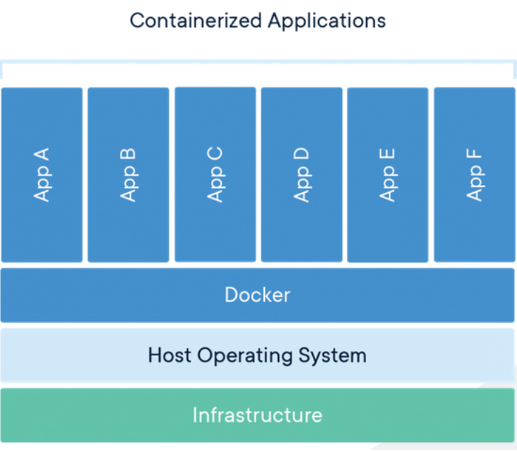

##### Figure 2.2 Docker container architecture (Docker, 2019)

According to Felter, Ferreira, Rajamony and Rubio (2014), the cost of communication between containers and to the host is significantly less than with hypervisor virtualization. As it is shown in FIgure 2.2 containers are running on the same OS, using the same kernel, but utilizing parent/child kernel namespaces without need to run redundant management processes on each instance. Other advantages of container technology over hypervisor virtualization such as smaller footprint, smaller storage requirements, speed of deployment, portability and faster start up time due to the fact that containers do not boot another copy of OS, quickly made them the tool of choice for scientific research and development environment.

Felter, Ferreira, Rajamony and Rubio (2014) came to the conclusion that containers are very close to native CPU performance while KVM’s are up to 22% slower on the same hardware. RAM performance for all three platforms - native bare-metal, container and KVM is about the same. Network tests revealed the fact of containers being close to native performance if used without default internal NAT and adding about 30ms latency through NAT. Storage performance with native and container setup showed almost identical results while KVM introduced significant overhead. The overall conclusion from Felter, Ferreira, Rajamony and Rubio, 2014 is that container technology either matches or exceeds the performance of hypervisor-based virtualization. Adding great flexibility, portability and a rich set of features provided by management solutions like Docker, containers are to take over various areas dominated by classic virtualization solutions.

Boetigger (2014) further emphasizes the advantages of Docker containers for automation over other virtualization platforms. The combination of cross-platform portability, modular elements, software versioning and ability to employ the Development and Systems Operation (DevOps) approach addresses many challenges faced by interested actors. Boetigger (2014) refers to the study at the University of Arizona (Collberg, 2014), stating that less than half of the software was successfully re-built and installed by researchers trying to replicate some study or test software. Basic dependencies and relatively complex matters such as order of evaluation of the code, contribute to difficulties in reproducing a study or testing a software solution.

Another factor contributing to challenges is imprecise documentation, where solutions and software packages built with different levels of skills and knowledge of underlying requirements result in a sufficient level of details in the documentation for some of them and lack of crucial information for others. The next issue to be addressed for successful testing is the robustness of results to the changes in software components due to updates, new versions and releases. A philosophy known as DevOps solves these problems by scripting and automation, rather than documenting all the necessary dependencies and components (Boetigger, 2014). Scripts, building and compiling all the necessary pieces, use already existing and well-known tools that make changes brought by DevOps more philosophical than technological. Linux containers and Docker management system address all the mentioned challenges, enabling users to script all the necessary steps and to provide a highly automated and self-building environment.

Additional features such as significantly lower demand on system resources and ability to concentrate all the building blocks and definitions of complex and very large images in a small basic text file called Dockerfile made this technology an absolute winner in scientific, technological, engineering and other areas. Even changes to the dependencies such as updates, previously breaking code were resolved by Docker image versioning. Docker also offers free cloud backend such as Docker Hub at https://hub.docker.com providing Continuous Integration (CI) services, automated builds, and the online repository for images.

Container technology is built on the idea of microservices and decoupling various solutions from each other in order to have better control over different parts of the executed software. It assumed that the classical approach of bundling various pieces of software in one single package is counterproductive and creates a lot of problems for professionals debugging and troubleshooting it. Also, this approach is expensive hardware-wise, resulting in unnecessary duplications and non-efficient resource utilization. So, it is rarely seen that a containerized solution contains one single container. Oftentimes software solutions consist of multiple containers, running in one bundle, exchanging data and serving the purpose.

Multiple containers can still be run without any centralized management solution, but that would neglect the overall idea of automation. During the last five years various management solutions, known as Container Orchestration Solutions, have been developed and presented on the market. Some of them, like Docker Compose and Kubernetes (Kubernetes, 2020), received wide recognition and became part of different solutions running all over the globe. While Kubernetes is preferred for enterprise-scale deployments, Docker Compose is an orchestration solution of choice for lab and development environments and for solutions having lower demand on scalability.
The comparative analysis of KVM and Docker containers technology is shown in table 2:

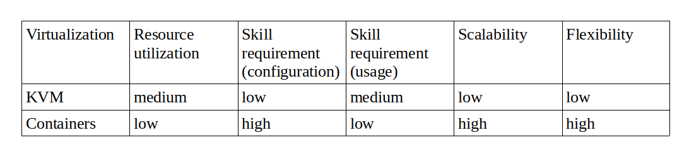
##### Table 2. Comparing KVM and Docker containers

The next section will look further into automation. Python and Bash scripting is considered to be the main candidates for task and software automation.

#### 2.4.2 Automation through Python and bash scripting

Infrastructure automation alone is one of the building blocks of the modern solutions development concept. Many existing solutions aim to solve the problem of processing, parsing, formatting and writing large amounts of log data. They need to be equipped with an application, written in a programming language and having software libraries being able to adequately and appropriately address the problem.

Lutz (2013) brings several arguments in favor of Python programming language over others. Python code is easy to read, which means it is also easier to maintain and reuse. It is sometimes five times shorter in length compared to Java or C++ programming languages. Python is highly portable and can be run on almost all the major computer platforms. Its code is run immediately after execution by a Python interpreter and does not need to be compiled, compared to compiled programming languages such as C and C++. The interpreted nature of Python contributes to accelerating the development process but might have a negative impact on performance for some applications. Another important point by Lutz (2013) is that Python has a large and continuously growing standard library, coming prebuilt at no cost to the user. Finally, Python is a highly integrated language being able to invoke other scripting or programming language code. Additionally, Python programming language has very rich operating system oriented tools and libraries, enabling it to easily manage and manipulate operating system level tasks if necessary.

Blum and Bresnahan (2015) define Linux shell as an interactive utility, interpreting commands provided by a user and executing them in the kernel of the operating system. The shell consists of two main components. The first one is a set of internal commands, managing programs running on the system and providing various functionality to alter files. The second component works as an interface to the kernel, accepting the name of the program to be run and passing it to the kernel. By grouping shell commands and equipping them with conditional checks, it is possible to build shell scripts - executable files, containing instructions to run (Blum and Bresnahan, 2015). This is a great feature to create utilities for commonly run tasks and routines. Among few shells available on a Linux system, Bash is the default shell application.

The automation process requires a thoughtful approach to avoid the situation of incorporating something of little practical value. Automation should follow the business requirements of the solution it is part of, not the other way around. No matter how feature-rich or powerful automation solution is, it has to address particular problems for a particular situation, and thus add value. The problem of repetitive tasks in computing is addressed best by employing scripting or programming. Bash shell scripting for solving relatively small tasks on Linux platforms (Blum and Bresnahan, 2015) and Python as a universal cross-platform programming and scripting language (Lutz, 2013) are considered as the best fit for various projects due to their flexibility, support ecosystem, mature documentation and broad user community.

The next section aims to review data presentation and visualization from TI point of view. It discusses the importance of comprehensive visualization as a factor contributing to the overall effectiveness of security strategy.

### 2.5 Data Presentation

Presenting data in ways that are concise and provide value is important. With the massive amounts of data produced in today’s systems, the presentation becomes even more important.  Professional data analysis implies comprehensive and structured reporting. A visualized front-end is an absolute necessity for large volumes of data in order to present it in a comprehensible format. Almost all modern programming languages offer modules for producing graphs, charts and tables as part of their standard libraries. There are also more sophisticated and well-developed platforms solving the problem of data visualization. A wide variety of commercial and Open Source solutions are offering data visualization services. The next sections look into the visualization options of TI data and tools commonly used for this purpose.

#### 2.5.1 Visualizing Threat Intelligence

TI data needs comprehensive visualization due to its high volume, velocity and real-time nature. Data captured by honeypots over a relatively short period of time can amount to over Terabytes in size. It is possible to filter the data of interest, using for example scripting, and representing the data in a basic format such as text files or a table. However, the most effective visualization for TI, as for any digital data, is plotting and graphing.

##### 2.5.1.1 Approaches

Addressing the problem of data visualization can take different approaches. The simplest one is to write the data to local files and read it and visualize using programming language modules, capable of producing tables and graphs. This method can be suitable for very basic types of data and for visualization of short-termed or live data. It does, however, lack scalability, the potential to zoom in or out in time or analyze complex combinations of values. Another method is streaming data of interest and reading it using similar tools, as described above. This method is suitable for live data only and has no capability to visualize historical data.

TI data heavily relies on historical trends and events to analyze the situation and draw the necessary conclusions. Its storage has to be reliable, searchable, organized and portable. Database solutions are a preferred way of storing data. They provide many features for data classification and grouping. Web-based data visualization front-end solutions are of great potential and popularity for TI analysis. They provide pre-built features and accept third-party plugins, addressing a vast majority of usage scenarios, enabling a user to focus on a problem he or she is working on and sparing a user from application-specific configuration overhead.

###### 2.5.1.2 Existing visualization solutions with a look at the benefits and drawbacks

Wang, Alexander & Wang (2015) reviewed methods and technological progress on Big Data visualization, revealing the importance of representation of data in a systematic form. Data visualization helps with discoveries leading to improved management decisions, better collaboration, increased return of investment and time savings. Also, it enables user interactivity resulting in improved engagement. At the same time, overwhelming users with visuals are not necessarily going to lead to the right decisions or certainty on the matter. As with many other technologies, the approach taken with data representation and visualization greatly influences the end result.

The advancement of information technologies resulted in improved data visualization methods and techniques, added to conventional tables, diagrams, charts, etc. Computers enabled users to build interactive visualizations, which are of great importance in many industries. Proactive monitoring, live data streams, geodata, business analytics and many other types of data are crucial parts of modern military and civil applications. Web application with database backend is the most common type of application of interactive data visualization.

The value delivered by modern applications comes at the cost of careful planning and deep expertise in the technologies utilized. It is very easy to overwhelm a user with large amounts of data, most of which is noise or irrelevant and does not add value. Also, the performance of underlying infrastructure can be impacted in a negative way if the data queried and plotted or visualized otherwise, is miscalculated in volume. Therefore, understanding the data analyzed and addressing quality issues are the main challenges to be faced with.

Nurgaliyev, Aimar and Karavakis (2016) conducted a comparative analysis on the 3 most popular analytics and visualization platforms - Kibana, Zeppelin (Apache Zeppelin, 2020) and Grafana. All three solutions are open source platforms well recognized in the scientific community. Compared to Grafana, Kibana has more features and options available. It is paired with Elasticsearch and Logstash solutions, working as a stack with extensive search and data objects storing capabilities. Kibana is a scalable, highly-configurable and feature-rich system, having a complex internal structure and enabling users to visualize various data types. Figure 2.3 shows an example of Kibana GUI. Focused deeply on search capabilities it provides Lucene query syntax based query syntax, allowing for selected time frame based search, Boolean operators, wildcards and field filtering. The search engine or Elasticsearch server accepts user-built scripts and returns the result of the execution of these scripts in real-time.


##### Figure 2.3 Kibana GUI (ELK, 2019)

The Grafana visualization system is focused more on visualization itself, allowing for axis customization and data transformation, saving user’s time. Many other features of Grafana coming for free have to be obtained for Kibana as commercial plug-ins. The key difference between the two solutions is in their purpose. Kibana is built on top of Elasticsearch and fits perfectly for analyzing log data. Grafana is shaped for reading and visualizing metrics, such as I/O counters, network and system metrics. Grafana tends to be more tolerant towards working with multiple time-series datastore systems, such as InfluxDB (InfluxDB, 2020), PostgreSQL, Elasticsearch and MySQL. Figure 2.4 shows an example of Grafana GUI.

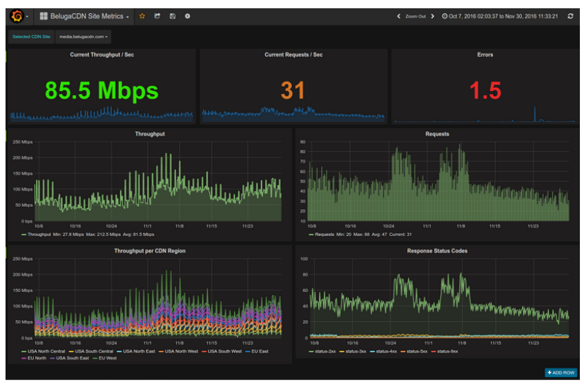

##### Figure 2.4 Grafana GUI (Grafana, 2019)

Zeppelin is another visualization solution, or more precisely it is a web-based notebook capable of interactive data analytics. Figure 2.5 shows an example of Zeppelin GUI. One of the most powerful features of Zeppelin is its ability to share Zeppelin Notebook URL among multiple users and visualize changes in real-time for all the users following it.


##### Figure 2.5 Zeppelin GUI (Apache, 2019)

Among the solutions reviewed in this section, Grafana and Kibana are the most common solutions for real-time data visualization. Both solutions have some similarities and strong sides. Although Kibana is also used as a standalone front-end solution, it is mainly considered as a part of ELK stack. Grafana has a rich development and support community and it is positioned as a standalone solution. Grafana has integration with various types of data sources such as Prometheus (Prometheus, 2020), MySQL, InfluxDB, MSSQL, PostgreSQL and many others. It is flexible, has many various plugins and integrated solutions.

Among many various data visualization solutions, Grafana and Kibana can be considered as the tools of choice for log, monitoring and similar data visualization. Kibana is a part of ELK stack and is a great tool to visualize log data stored in the Elasticsearch database. Grafana is not oriented to some particular database type. It was initially built as a time-series data visualization tool. In the case of InfluxDB used as data storage, Grafana is a front-end solution of choice.

### 2.6 Conclusion

In this chapter different technologies and solutions are considered as potential components of honeypot solution, sourcing geolocation TI. Honeypots are divided into three groups by the interaction level - low, medium and high. Low interaction honeypots can be any application or native system services such as SSH or HTTP, listening on a particular port and logging activities on that port. Further processing of gathered logs can be done with an application written in any programming language. To the day, Python is one of the most popular and frequently used languages. Bash scripts are often used as an intermediate solution, piping and manipulating input and output of different tools.

InfluxDB is a well-known and mature time-series oriented database solution for storing the data of interest, which is geolocation data correlated with time counters. Kibana and Grafana are the most popular front-end solutions used for data visualization. Both solutions have a lot of third-party plugins and native integrations with data sources of various origins. Docker container technology is the next step in virtualization and has a proven record of better performance, flexibility, automation, integration and portability. Docker Composer is a wrapper, used for orchestration of small to middle-sized multiple container environments. Kubernetes is another solution for container orchestration, more suitable for complex and demanding infrastructures.

All the information collected and presented in this chapter establishes a foundation for designing the prototype of SSH honeypot. The solution to be built would use all the strong sides of technologies and solutions reviewed in Chapter 2. It also would take into consideration known drawbacks and weaknesses. The next chapter will define the proof of concept prototype and describe it with all its details.

<div style="page-break-after: always;"></div>

## Chapter 3: Theoretical Honeypot Architecture

### 3.1 Introduction

The previous chapter explored honeypots for Threat Intelligence and looked at the different technologies and components that can make up such honeypots. This chapter aims to develop a theoretical architecture model for a SSH honeypot and introduce a proof of concept for this honeypot solution. This proof of concept should aim to address the lack of easily deployable honeypot solutions and serve as a base model for further development and expansion. The theoretical architecture will consist of several core components, including tools combining these components together and the underlying infrastructure needed for them to function, such as the network. The next section will define the theoretical architecture for the proof of concept honeypot this study aims to construct.

### 3.2 Theoretical Architecture

To achieve the objectives set out for this study, this section extrapolates from the information gathered in Chapter 2 and proposes a theoretical architecture for a SSH honeypot. This architecture combines multiple components into a single solution, aiming towards a simplified honeypot solution that can easily be rolled-out and adapted according to the Threat Intelligence needs. The theoretical architecture of the honeypot solution incorporates the following components:

- Low interaction honeypot, running SSH service on Linux Ubuntu OS;
- A software application, parsing log files and processing data of interest;
- Database solution storing the processed data; and
- Front-end solution for data visualization.

Critical to this architecture is the ability for these components to be deployed in a virtualization platform which packaging the components into one single solution in parallel with other underlying infrastructure such as network and servers, hosting the solution. The next section describes the desired functionality of the solution.

#### 3.2.1 Desired functionality

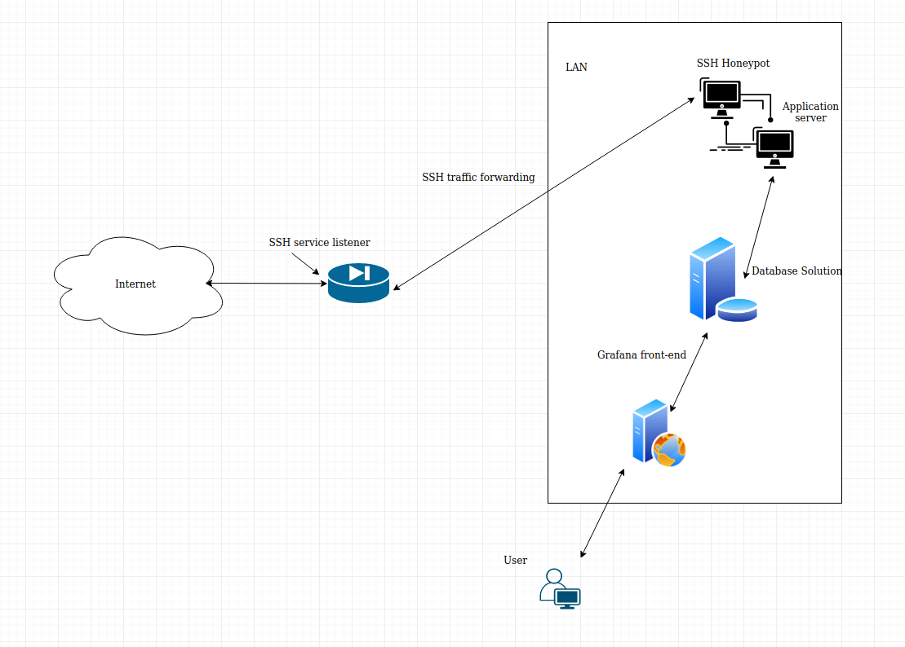

##### Figure 3.1 General workflow

As discussed in Chapter 2, Threat Intelligence is a key control used in the prevention of cyber-attacks. Honeypots play an important role in gathering the information needed. Figure 3.1 illustrates the basic operability of such a solution. At a high level, Figure 3.1 shows the solution where an attacker would attempt to connect to a service listening on the perimeter. Traffic is forwarded to the honeypot server where the data is processed. This data is stored in a database and graphically displayed in a frontend for easy data analysis and intelligence gathering.

For the purpose of this study, the SSH service was selected as the desired service to run on the honeypot. As mentioned in section 2.3.2, the SSH service is used for remote management of network resources and all login attempts from unknown sources can be considered malicious. SSH is particularly valuable to attackers, as gaining entry would mean access to possible high value information systems. In practice, each login attempt will leave a log entry in the SSH service logging subsystem, containing the IP address of the attempting host. In the case of this solution, the SSH service should run as a honeypot with the login functionality disabled.

In addition to the SSH service, a Python application for parsing log files and processing the data of interest is the next core component needed in the solution. It should read SSH service logs, parsing and extracting the data of interest, which includes the IP addresses of hosts attempting remote logins. IP addresses extracted are then processed through one of the Python geolocation modules, outputting geolocation information for each IP address.

Output data, or in this case geolocation information, would be written to a database solution for storing and further usage. The database portion of this solution should preferably be time-series DB, that is known to have a proven record of real-time data handling (Influxdata, 2020). The final core component of the solution is the front-end application for data visualization. This framework proposes a web-based front-end solution, outputting the desired elements needed in the Threat Intelligence strategy. It would be querying and fetching data from the database solution and visualizing it in graphs, tables or maps.

The implementation of this solution can vary depending on the interoperation of core components, but the overall model should stay as close as possible to the described one for optimal results. The next section delves into the details required to build the honeypot solution.

#### 3.2.2 Theoretical Honeypot Model


##### Figure 3.2 Honeypot model

Core to the theoretical framework that make up the Threat Intelligence solution, is the honeypot itself. To reach the desired functionality it is necessary to employ certain solutions and configure them for interoperability. The physical computer, hosting the solution would preferably run Linux Ubuntu OS due to its well-known stability and flexibility as well as the fact that it is open-source. Another advantage of Linux Ubuntu is its great integration with container virtualization solutions such as Docker. Many benefits of Docker were explored in Section 2.4.1 and would therefore be best suited as a virtualization and automation solution for this honeypot. Docker is known for its successful usage in various industries over the last decade. It is highly customizable, flexible and far beyond the competition of its classic virtualization counterparts. Its programmable nature enables developers for professional software and solution packaging and seamless deployment by less experienced users – something that is key for the objective of this study.

The SSH honeypot solution would require at least three instances of an operating system, running core components - (1) SSH service and application server, (2) database server and (3) a front-end server. Docker enables the running of all these instances with the smallest footprint possible and less resource demands compared to other virtualization platforms.

As per Figure 3.2, the first container would run SSH service with necessary configuration and Python application bundled together. SSH service should be configured to listen for incoming connections on TCP port 2222, instead of default port 22. This is done in order to attract more sophisticated attackers, being able to distinguish services on the remote host, not just by TCP port, but also by certain behavior. Python application running in the same container would extract and process the data of interest and send the output of the processed data to the database solution. There is no benefit to using a prebuilt SSH Docker image due to the proprietary nature of the application server and the non-standard configuration of the SSH server. The container used would therefore need to be a standard Linux Ubuntu OS container.

The second container would host the Influx DB solution. Section 2.5.1.2 looks at various visualization solutions and datastores. Influx DB is a well-known time-series database used extensively in real-time data visualization. Separating database stores from other instances is best practice and SSH honeypot solutions are not an exception from that rule. DB container does not need to be configured in a custom way or with customized settings and it would make sense to use a ready Docker image of InfluxDB, instead of building a proprietary one. In theory, however, this is not an absolute requirement and is up to the user to decide.

The third container is the Grafana web server, communicating to the DB server and querying necessary data. Grafana server is the user interface of the solution, visualizing all the necessary information. It has an impressive amount of pre-built visualization tools and solutions, simplifying configuration. Grafana also does not need to be customized and the vendor built Docker image of Grafana solution would fit into the model. As with InfluxDB, using the vendor’s image of Grafana is not an absolute requirement.

The last component of bundling separate containers into one single solution is Docker Compose orchestrator. As discussed in Section 2.4.1, Kubernetes and Docker Compose are two solutions potentially addressing orchestration issues for a solution like this. Docker Compose would however be a better choice in this particular case due to its simplicity and reputation with small environments.

This section proposed a potential model for Honeypot solution on the level of containers and orchestrator. The next section steps into details around the underlying infrastructure, particularly looking at networking.

#### 3.2.3 Logical Network Model


##### Figure 3.3 Network Model

A stable internet connection which is isolated from the production network, in the case of shared hardware, is key to this honeypot solution. Figure 3.3 illustrates the logical network topology, such a solution would require in its most basic form. In the current model, a Cisco firewall and Cisco switch are chosen as network hardware due to the reliability, granular configuration potential and general reputation of Cisco network solutions. Although, it is not an absolute requirement to implement Cisco devices for the purpose of this solution, as it is meant to be deployable in any environment. Almost any network firewall and switch can be used for the same purpose.
The firewall installed on the edge of the network would have TCP port 2222 forwarded to the Ubuntu host on the internal network. This way all the traffic arriving on TCP port 2222 would be forwarded to the machine hosting the SSH honeypot. Additionally, a firewall rule allowing communication from the outside network to inside on TCP port 2222 has to be configured. Otherwise, the firewall will stop the traffic flow from the outside network to inside.  
The switch is a next-hop on the internal network. The solution does not require any specific switch configuration if the physical network is not shared. If the switch is shared and the same hardware participates in networking operations other than the purpose of the SSH honeypot solution, then additional isolation on the network level implementing segmentation might be necessary (Cisco, 2019).
The Ubuntu host is the recipient of all SSH Honeypot traffic on the physical level. To forward this traffic to the relevant participants, the Docker host has to have port forwarders configured on the Docker container level. Normally port forwarding rules for containers are defined in two places:

- Dockerfile; and
- Docker Compose configuration file “docker-compose.yaml”.

The traffic flow for the solution would work as follows:

- TCP connection from the Internet on TCP port 2222 arrives on the firewall;
- The firewall matches incoming traffic with firewall rules and finds the rule permitting it;
- The firewall checks NAT rules or port forwarding rules if NAT is not configured against the traffic specifications;
- It finds a rule according to which it forwards the traffic to the Ubuntu host;
- The Ubuntu host receives the traffic, matches it against its firewall rules if enabled and configured and all the listening services;
- Docker service is listening to TCP traffic on port 2222, forwarding it to SSH Honeypot container; and finally
- Host OS lets the traffic through and Docker service forwards it to the relevant container.

This section described the desired underlying network infrastructure and gave some insight into traffic flow and the way connections would be handled on participating hops on the network. The next section will propose a combined complete architecture including all the components needed in this solution, such as the Docker containers, Ubuntu host and network infrastructure.

#### 3.2.4 Theoretical architecture

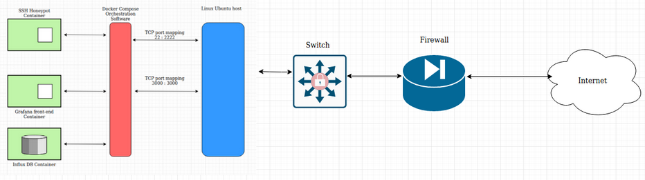

##### Figure 3.4 Teoretical architecture

The previous subsections have broken up the core components needed for a Threat Intelligence honeypot packaged in an easily deployable solution. The desired functionality, requirements at a host level and the network requirements have been discussed and motivated. Figure 3.4 reflects the most important components combined in one infrastructure, as a theoretical architecture for a single deployable solution. Combining these core components, should enable any organization or entity to perform Threat Intelligence, without the need for highly technical and complex or expensive honeypot solution deployments. The next section will explore and develop this theoretical architecture into a functioning proof of concept prototype.

### 3.3 SSH Honeypot: Proof of Concept Prototype

This section discussed the development of a prototype as a proof of concept of the theoretical architecture model developed in Section 3.2. The modeled solution is flexible and can be extended with any additions and enhancements as desired by the user. The honeypot can be enhanced with any protocols e.g. web server, turning SSH honeypot into a combined SSH/HTTP/HTTPS/FTP honeypot. Furthermore, it can be enhanced with additional functionality like launching counter-intelligence routines and analyzing attacking hosts with the Network Mapper (NMAP, 2019) or a similar applications, to gather more information.

To embody the current model, it is necessary to build core components and combine them accordingly. The next section will discuss and explain the steps in building the core components and combining them into a single solution.

#### 3.3.1 Step 1 - Defining SSH Honeypot container

In this section the building of the SSH Honeypot container will be explained. The prerequisites for a host machine hosting Docker solution are the following:

- Computer with at least 8 GB of RAM, 120 GB of storage and Intel I3 processor;
- Linux Ubuntu OS 16.04;
- Uncomplicated Firewall (UFW) service should be disabled for the sake of simplicity or alternatively can be configured with appropriate rules;
- Docker version 19.03.1, build 74b1e89e8a;
- Python 3.5.2; and
- Docker Compose version 1.12.0, build b31ff33

To build the SSH Honeypot container, Docker daemon is instructed with the following commands:

```
# Use an official Python runtime as a parent image
FROM ubuntu:latest
# Set the working directory to /app
WORKDIR /app
# Copy the current directory contents into the container at /app
ADD . /app
# Installing dependencies and specified software
RUN apt-get update && apt-get install -y net-tools && apt-get install -y iputils-ping && apt-get install -y ssh && apt-get install -y vim && apt-get install -y rsyslog && apt-get install -y sqlite3 && apt-get install -y python3-pip
# Installing software specified in the file
RUN pip3 install -r requirements.txt
# Exposing port 2222 to outside networks
EXPOSE 2222
```

Dockerfile instructs daemon to use the latest Ubuntu image from the official Docker repository to fetch and build the local image, acting as the main container. The next step instructs to set the “/app” directory as a working directory on the container. The next instruction recursively adds all content of the current directory on the host to the “/app” directory of the newly created container. After the container is built, it is instructed to run a chain of commands, installing necessary updates and upgrades, tools and services. And the last step is to expose a particular port, in this instance TCP port 2222, on the container, making it available for further mapping to the port of choice on the physical host.

#### 3.3.2 Step 2 - Running SSH honeypot container using Docker Compose

After creating an SSH Honeypot container, it needs to be initialized. Due to the architecture of the solution, multiple containers need to be run together. Docker Compose is a software of choice to orchestrate the components of the solution. Below is the portion of “docker-compose.yaml” instructions file, relevant to SSH Honeypot container:

```
version: '3'
services:
    honeypot:
        Build:  .
        hostname: honeypot
        container_name: honeypot
        ports:
            - "2222:22"
        command: /bin/sh /app/hp_script.sh
```

Docker-compose file instructs Compose software to map TCP port 2222 on the host exposed via Dockerfile to TCP port 22 in the container. In the next step, it runs “hp_script.sh” shell script doing the following:

- Start SSH service;
- Enable TCP port 22 for SSH daemon to listen;
- Enable all address families ipv4 and ipv6;
- Listen for all IP addresses;
- Enable SSH logging to /var/log/auth.log file;
- Set logging level to INFO, enabling verbose logging;
- Restart SSH daemon after changes;
- Start Rsyslog daemon;
- Set auth.log file location; and
- start an infinite loop executing Python application “db_writer.py” that reads and parses SSH log files.

Python application in its turn runs the following sequence of steps:

- Reads each line of SSH server log;
- Extracts IP address and timestamp, converting the latter one into InfluxDB appropriate format;
- Processes IP addresses through the GeoIP module, correlating each IP with continent, country, latitude, longitude, geohash and location;
- Builds Influx DB compatible data structure, in this case, dictionary, adding a converted timestamp; and
- Writes created data structure to the DB.

At this stage SSH honeypot container is up and running. It listens to incoming connections, registering their details such as IP addresses in the authentication log file. Python application is running in constant loop reading over and over the authentication log file, extracting IP addresses and processing them through the geolocation module. The data containing geolocation data for the correlated IP address such as country, continent, longitude, latitude and geohash is organized into Influx DB compatible data structure and written to the database. The next section describes Influx DB container configuration.

#### 3.3.3 Step 3 - Defining and running Influx DB container  using Docker Compose

Python script reads and parses SSH authentication log, extracting timestamp and IP of the hosts, attempting to login to the SSH Honeypot. This data needs to be stored. As such, the Python solution creates a dictionary and writes the data to Influx DB, running in a database container. This database will specifically store timestamp, country, continent, longitude, latitude and geohash for each correlated IP address.
Database container is defined in “docker-compose.yaml” with the following settings:

```
    db:
        image: influxdb
        hostname: influx
        container_name: influx
        env_file:
           - db-var.env
```

It uses environment variables defined in “db-var.env”, creates "honeypot" DB and sets username and password for administrator. At this stage Influx DB is ready to accept data sent from the Python application running on the Honeypot container. It is also ready to serve the data stored to the front-end solution, querying it and visualizing the data. The next step describes Grafana -  the front-end solution, responsible for data visualization.

#### 3.3.4 Step 4 - Defining and running Grafana container  using Docker Compose

The final part of “docker-compose.yaml” file contains instructions relevant for building and running Grafana container, mapping internal TCP port 3000 of container to TCP port 3000 of the host. Grafana creates the frontend which users will access to view and analyze the collected data. Port mapping makes Grafana web interface available to users, connecting from other computers.

```
    web:
        image: grafana/grafana
        hostname: grafana
        container_name: grafana
        ports:
            - "3000:3000"
```

At this stage Grafana solution, serving the purpose of user interface is ready to query the database and visualize the data of interest. In the next section configuration of network firewall will be explained.

#### 3.3.5 Configuring network firewall

Modern network firewalls differ slightly in their implementation of traffic filtering. At the same time, most of them use some general concepts common for all similar solutions. Cisco firewalls are implemented in two main variations - as part of Cisco Internetwork Operating System (Cisco IOS) or dedicated network firewall solution Cisco Adaptive Security Appliance (Cisco ASA). Both implementations benefit from a zone-based approach, treating the environment based on zones and not particular physical interfaces.

Cisco ASA is a preferable solution for scenarios, where routing is secondary and network traffic filtering and security features are the primary goals. It has strong boundaries a firewall is expected to operate within and set of predefined features, adding efficiency in a task of network administration. For this particular model, two predefined zones “inside” and “outside” are sufficient and will require relatively small configuration effort. To make traffic from the Internet reach the SSH Honeypot, it is necessary to expose port 2222 to the Internet or in other words zone “outside”. For that, the network firewall needs to be configured with appropriate NAT rules to forward traffic from “outside” zone on TCP port 2222 to the “inside” zone, particularly the Docker host computer. Also, relevant access-control lists have to be configured and applied in order to allow desired traffic on TCP port 2222 from the “outside” zone to the “inside” zone.

The concept described is a high-level model, applicable for the most modern firewall solutions. The specifics of the configuration will differ from vendor to vendor, but the overall idea will stay close to the described one. The next section explains how the solution would be operated under the normal circumstances.

#### 3.3.6 Operating the solution

At this stage the solution is defined as 3 containers running in one bundle, exchanging data and publishing user interface to the external world through the network firewall. To start and operate the solution it is enough to run Docker Compose utility from the same folder as “docker-compose.yaml” is situated. Docker Compose orchestrator will start the first container according to Dockerfile content and will engage the rest of the containers according to instructions in “docker-compose.yaml” file. From that point on containers can be manipulated in various ways using “docker” and “docker-compose” utilities.

Below examples of the commands to build, start, manipulate and stop solution are shown:

```
# Building and starting the solution from the folder where “docker-compose.yaml” is situated
docker-compose up --build

# Show running containers
docker ps

# Show all the containers available on the host
docker ps -a

# Show images on the host
docker image ls

# Accessing particular container’s command line
docker exec -it containerid bash

# Stop and remove containers running under Docker Compose orchestrator
docker-compose down
```

This section described the basics of running and manipulating multiple containers. Docker container and Docker Compose solutions have a very rich set of tools and it is not possible to show even a small portion of their capabilities in a few examples. At the same time, commands shown are a good starting point to delve further and explore the full potential of container technology.

At this stage the model of the solution is described in full with all the necessary details. The next section will conclude on Chapter 3 and move to actual implementation of the solution.

### 3.4 Conclusion

This chapter discussed the theoretical architecture and presented a model of a complete SSH Honeypot solution, including data processing and visualizing components. The model included various components such as a computer for hosting Docker containers, Docker container infrastructure, Docker Compose orchestrator, Python application and underlying network infrastructure. These components, in theory, should allow for an easily deployable threat intelligence honeypot.

As a proof of concept, the model was developed into the light-weight prototype. The prototype, including all its building blocks, showed how the solution can be replicated for further research or usage by interested users. The overall conclusion on the prototype is that the proposed model could address the need for a honeypot solution to gather threat intelligence data which is easily deployable and cost effective. The prototype built from the proposed model ran stable and has shown the expected results. The next chapter will examine the results produced by the solution and analyze collected and processed data.

<div style="page-break-after: always;"></div>

## Chapter 4: Solution

### 4.1 Introduction

The previous chapter proposed a theoretical architecture model for a SSH honeypot and developed this model into a proof of concept prototype. This chapter will examine the results produced by the prototype that has been running over a certain period. Additionally, it will analyze data collected and computed, looking into interesting aspects and events that might be of interest to an organization running the solution. Finally, it will discuss some of the problems experienced and lessons learned.

### 4.2 Proof of Concept Prototype

At this stage, the prototype discussed in Chapter 3 has been fully functioning and collecting data for a period of 4 weeks. The code, partially presented in Chapter 3, was expanded to automate to the maximum the process of building the SSH Honeypot. After a month of operating the solution, it was found that the solution does not require any additional administrative effort and behaves as expected, therefore limiting the requirement of human interaction. This section will explore the prototype in its final form looking at the required user side pre-configuration for the web-interface, and fetching data from the database.

Figure 4.1 illustrates the login screen of the Grafana web-interface, available on https://docker-host:3000 , where “docker-host” is the IP address of the computer hosting Docker containers. 


##### Figure 4.1 Grafana login screen

The default credentials to access the Grafana web-interface as administrator and configure it, are the following, and should be updated in real-world deployment so as to limit access to authorized personnel:

username: “admin”
password: “admin123”

After login, the user is presented with the default view of Grafana and can configure dashboards and plots. Next step is to add a data source, as it is shown in Figure 4.2


##### Figure 4.2 Add data source

In this particular case, the HoneypotDB type of Influx DB data source has been added as it is shown in Figure 4.3.

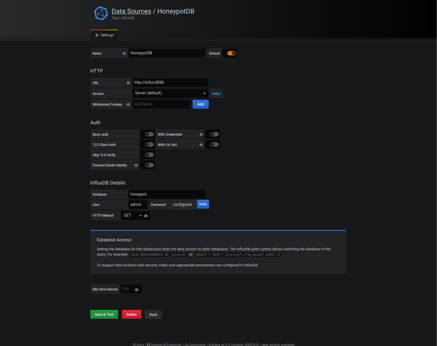

##### Figure 4.3 Adding HoneypotDB as a source

Finally, to create the dashboard which will visually represent the collected data, the user needs to choose “Create Dashboard” from the main menu, click “Choose visualization” and choose the type of visualization desired. Figure 4.4 shows the page where a visualization type can be chosen.

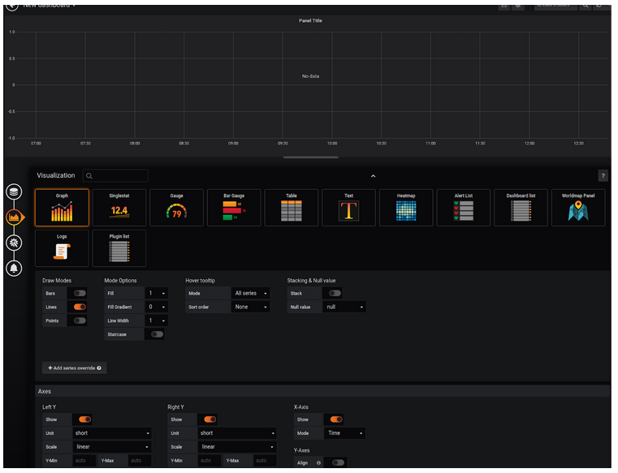

##### Figure 4.4 Available visualization types

This section discussed user side settings for the web-interface, fetching data from the database. In the next section, data gathered over a period of 4 weeks is visualized and analyzed.

### 4.3 Data analysis

In this case, two Graphs and one Worldmap Panel have been chosen as visualization tools. The chosen graphs and panels are completely up to the user and the requirements of each individual entity. Worldmap Panel might be missing from the default view and in that case, needs to be added from the plugin list as it might not be available by default. It is important to understand that the data visualization part of the solution can be configured with any number of graphs, tables, heatmaps and other tools at the convenience of the user.

### 4.3.1 Visualization of login attempts made from different countries

Figure 4.5 shows the first graph visualizing the list of countries login attempts were made from with the number of attempts for a particular time window.

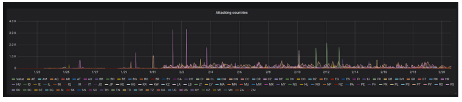

##### Figure 4.5 Login attempts per Origin Country for time interval 23.01.2020 - 20.02.2020

As seen in Figure 4.5, the first week after starting data collection, the number of attempts were relatively low. To zoom in to a time period of interest, Grafana provides various tools on the dashboard. For the sake of example, two-time intervals have been chosen in Figure 4.6 showing date 23.01.2020 to date 28.01.2020 and Figure 4.7 showing date 12.02.2020 to date 20.02.2020.

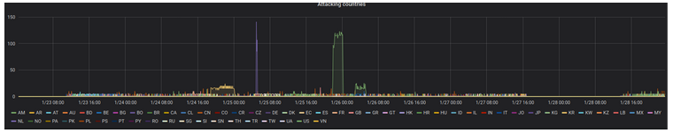

##### Figure 4.6 Login attampts per Origin Country for time interval 23.01.2020 - 28.01.2020


##### Figure 4.7 Data visualization for the time interval 12.02.2020 - 20.02.2020

As seen from the graph, the geographical location of connection attempts made is spread across many countries around the world. To choose and visualize one connection source, a user can click on any country of interest. For example, analyzed by the number of attempts made, France is a leading country on 12.02.2020 and 13.02.2020 with peaking numbers of 400 and 300 attempts within 1 hour per each date. Attempts from China as it is shown in Figure 4.8 peak at 125, averaging above 25 between 12.02.2020 and 13.02.2020.


##### Figure 4.8 Login attampts made from China


Russia seems to be partly interested in the SSH Honeypot as it is ignoring it from time to time, as it is shown in Figure 4.9.


##### Figure 4.9 Russia is part-time involved in SSH login attempts

Connection attempts from the United States demonstrate the same level of interest as those seen originating from China, as Figure 4.10 illustrates an average of 25 attempts between 12.02.2020 and 20.02.2010.

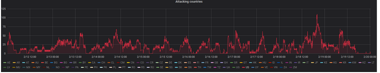

##### Figure 4.10 Attempts from the United States

To configure a similar graph, the user needs to build Grafana query as per Figure 4.11, where the graph is configured to show the last 30 days:

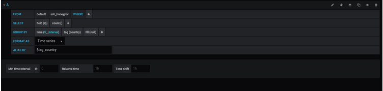

##### Figure 4.11 Grafana query to show the last 30 days of data

Database query in text mode would look like this:

```
SELECT count("ip") FROM "ssh_honeypot" WHERE $timeFilter GROUP BY time($__interval), "country" fill(null)
```

The query above counts IP data in the “ssh_honeypot” database, grouping it by country and time interval.

#### 4.3.2 Total number of hits in real-time

This section looks closely at the next graph, visualizing the number of hits during a specified time interval. Figure 4.12 shows the resulting output for the last 30 days the SSH Honeypot was running.


##### Figure 4.12 The total number of attempts to log in

Grafana query building this output is shown in Figure 4.13.

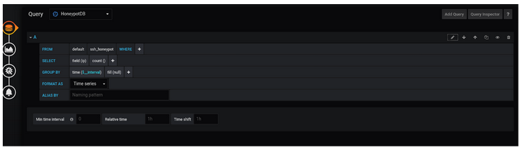

##### Figure 4.13 Grafana query to show the number of hits

#### 4.3.3 Global attack map

Figure 4.14 reflects the geographical map of sources where login attempts were made from during the specified time interval. In this case it illustrates 4 weeks’ worth of data, with green dots representing less than 10 attempts, orange for more than 10 and less than 100 attempts, and red for more than 100 attempts.


##### Figure 4.14 Global attack map

The map is real-time and can be adjusted in Grafana to update every 5 seconds with live data. This visualization is useful for reflecting the big picture of live operations. Figure 4.15 shows the zoomed-in location of attempts from China, who made more than 96000 attempts during the 4 weeks.


##### Figure 4.15 Zoomed-in location of the attacker

The query in Figure 4.16 fetches a number of IP entries during the time interval specified, grouping entries by coordinates.


##### Figure 4.16 Grafana query for map visualization.

Database query in text format would look like the following:

```
SELECT count("ip") FROM "ssh_honeypot" WHERE $timeFilter GROUP BY "latitude", "longitude", "country"
```

#### 4.4 Experienced problems and lessons learned

This section will discuss problems faced during the modeling, prototyping and operational phase. Developing the architectural framework, resulted in very little problems mainly because of the nature of the theoretical model that has its foundation in research. At the same time, it was the most important one in terms of planning and preparing to build a working prototype. The most important lesson learned from the modeling stage is that any component of a model should have at least two proposed alternatives, similar by functionality and applicable to a project.

The prototyping stage assumes a lot of experimenting and sometimes, especially in a project with open-source components, not having all the components easily function together. In this  case Python geolocation modules, computing the geographical coordinates from IP was the component causing the most technical issues requiring additional adjustments and code tweaking.

The takeaway lesson from the prototyping stage was the importance of keeping track of all steps taken. Prototyping implies experimenting and any unmanaged deviations from the initial plan might result in time losses. Therefore, a thorough record of all the various attempts and results is the best assistant for the operational phase, when troubleshooting and problem-solving are part of daily routine.

Finally, the operational stage taught some lessons as well. Although the software solution might be ready for a project, hardware requirements are not to be undermined. Any miscalculation related to resources could potentially result in downtime. In this case, shortage of storage on the physical computer caused an outage of a few hours. Therefore, the hardware in the solution should match the desired operational functionality..

### 4.5 Conclusion

This chapter reviewed the operational stage of the solution. It discussed proof of concept prototype and some available features of user-interface. The data analysis section presented and explained the results of 4 weeks of data collection and processing. It dived into some statistics of data presented and discussed specific visualization details and database queries. The last part of the chapter revealed experienced problems and stated lessons learned. The next chapter will conclude the study and explore possible future research.

<div style="page-break-after: always;"></div>

## Chapter 5: Conclusion

### 5.1 Introduction

This chapter will give a high-level overview on the problem and proposed solution. All the findings will be summarized and reviewed. Accomplishment of objectives and sub-objectives is explored in this chapter. Final conclusion on the research and its results is yet another discussion point. The chapter is summarized by final suggestions on the future work.

### 5.2 Summary of Findings

This research aimed to accomplish a number of objectives, addressing a specific problem. Among several findings, contributing to the overall result there are few worse to mention specifically.  

Docker has appeared to be an extremely flexible and powerful virtualization solution. Its highly configurable nature and impressive performance put it far ahead of any other virtualization solutions. A tiny footprint is another advantage, making container technology a platform of choice for research and development projects, although not restricting to them.

Software packages used for calculating the geolocation of a host from an IP address rely heavily on back-end databases. Not all the IP addresses can be precisely mapped to a geolocation due to outdated entries in databases it is checked against. Although, for the majority of cases this mapping is accurate enough, this fact needs to be taken into the consideration.

The prototype built in Chapter 4 revealed other interesting findings as soon as it went online. Despite the fact that SSH listener was published on the Internet on non-standard port TCP 2222, it almost immediately attracted attention of potential attackers. Within the first 6 hours a number of attempts to login and gain access have been made from US, Russia and China. This is a good indicator of the scale of scanning, performed by malicious actors on the Internet.

### 5.3 Accomplishment of Objectives

#### 5.3.1 Primary Objective

The primary objective of this study is to develop an easily deployable sensor solution, to gather and visualize geolocation intelligence on possible threats.

#### 5.3.2 Sub-Objectives

In order to accomplish the main objective, a few sub-objectives were set and accomplished, such as:

- Explore intelligence gathering solutions, specifically looking at honeypots and the  integration of various platforms and visualization tools.

- Develop a Docker based honeypot solution which listens for network traffic on SSH Port 22, then logs source IP information and visualizes geographic attack data for threat analysis.

- Analyze intelligence data over a period and determine the viability of the proposed solution.

#### 5.3.3 Accomplishment

The primary objective of the study was achieved by developing a complete solution, consisting of multiple components, serving the purpose. First component built is the data collector, a honeypot solution attracting malicious actors to make their attempts to login. The second component is a Python application, parsing the data of interest, formatting it and adding to a database. The next component is responsible for data visualization, fetching the data from the database and visualizing it. All the components mentioned are wrapped into a Docker container solution with some elements of orchestration. Docker bundles all components into one single package, requiring very little interaction from a user in order to have it running. The primary objective was successfully accomplished with no deviations from the initial plan.

Sub-objectives of the study were accomplished also according to initial planning. Literature research explores various existing solutions and previous work on the matter. Honeypots, virtualization platforms, visualization solutions and potential for integration of these components were reviewed through the literature research, emphasizing strong sides of previous attempts and looking for a room for improvements.

Docker container solution was successfully employed for the research. Attempt to make the most of Docker's powerful and flexible structure has been made. Different components were gathered and grouped under multiple containers. Docker Compose orchestration tool provided an abstraction layer, wrapping multiple containers in one single infrastructure, running the solution, collecting and processing data, and finally visualizing the end product.

The last sub-objective was accomplished by analyzing the data over a period of time and drawing consecutive conclusions (Chapter 5, 5.2 Summary of Findings).

### 5.4 Conclusions

The final conclusion on the research is that sensors and honeypot solutions published on the Internet are great sources of Threat Intelligence data, enabling interested parties to collect, analyze and conclude on it. Geolocation data, calculated from TI raw data helps to understand better malicious activities on the global Internet during different events, time periods and specific incidents. Malicious actors hunting for prey on the Internet have specific interests, more or less tied to their geography. Revealing the scale of attacks and their vectors and linking them to specific geographical locations helps to obtain valuable intelligence information, assisting to draw further conclusions, improve security strategies and defence mechanisms.

Another important conclusion is that despite continuous efforts by academic researchers, commercial parties and Open Source enthusiasts, there is a big potential for improvement of existing solutions and developing new ones. The market still lacks affordable generic TI solutions providing geolocation intelligence that are easy to deploy and operate. Demand on TI solutions, having potential to be paired with other security technologies, is growing. More research and attempts to convert existing solutions to effective tools to be seen in the years coming.

### 5.5 Suggestions for Future Research

This work could not possibly answer all the questions related to the area of research. By achieving the main and subsequent objectives and addressing a particular problem, it opens new opportunities for further work on the area. One of the topics for future research could be calculating more precise geolocation information by implementing and maintaining a local geodata database. The database should be cross-checking and updating with similar existing databases for more precise data. Application layer, maintaining the database has to have a logic for discarding fake or outdated information and committing the best data available at the moment of processing.

Another relevant area for future research could be integration of the proposed TI solution with IPS systems, taking actions on specific metrics and alerts triggered by TI data. This can be a complicated task due to the probability of a high amount of false-positives, triggering unnecessary actions on the IPS side. That implies high-accuracy tuning of the TI solution and IPS system, to avoid noise and false-positive alerts.

The last suggestion for a future work is adding static reporting capabilities to the proposed TI solution. To address it, a number of filters and report generating software modules have to be added to the Python application server. Python programming language has a variety of available modules, generating PDF and many other file formats. Some adaptation of third-party software modules might be required in order to accomplish this task.

<div style="page-break-after: always;"></div>

## Reference List

1. Apache Zeppelin, (2020). About Apache Zeppelin. Accessed on 05.01.2020. Available at http://zeppelin.apache.org/

2. Baykara, M., & Das, R. (2015). “A Survey on honeypot technologies used in intrusion detection systems”. Proceedings of 16th ISERD International Conference, 2(November), 14–19.

3. BBC, 2017. “NotPetya cyber-attack cost TNT at least $300m”, BBC Technology. Accessed on 19.11.2019. Available via https://www.bbc.com/news/technology-41336086

4. Bitdefender (2019), Threat Intelligence Datasheet. Accessed on 11.12.2019, available via   https://download.bitdefender.com/resources/media/materials/2019/advanced-threat-intelligence/Bitdefender-2019-ThreatIntel-Datasheet-CREAT3637-en_EN-interactive.pdf?adobe_mc=MCMID%3D33918355123987742724615809577921038593%7CMCORGID%3D0E920C0F53DA9E9B0A490D45%2540AdobeOrg%7CTS%3D1579446492

5. Blum, R. and Bresnahan, C. (2015). Chapter 1: Starting with Linux Shells. Linux Command Line and Shell Scripting Bible, Third Edition. John Wiley & Sons, Inc.

6. Boettiger, C. (2014). An introduction to Docker for reproducible research, with examples from the R environment. Center for Stock Assessment Research, Santa Cruz, USA.

7. Cisco Corporation, (2009).  Cisco Security Control Framework. Available via https://www.cisco.com/c/en/us/td/docs/solutions/Enterprise/Security/CiscoSCF.html

8. Cisco SAFE Operations Guide, (2019). Domain: Segmentation. Available via https://www.cisco.com/c/dam/en/us/solutions/collateral/enterprise/design-zone-security/safe-og-domain-segmentation.pdf , Accessed on 02.02.2020.

9. Cito, J., Ferme, V. & Gall, H. (2016). Using Docker Containers to Improve Reproducibility in Software and Web Engineering Research. University of Zurich, Zurich, Switzerland, University of Lugano, Lugano, Switzerland.

10. Collberg, C. (2014). Measuring Reproducibility in Computer Systems Research. Available at https://pdfs.semanticscholar.org/94f7/2e68ba2c602a913e198fa283d22d7d736f55.pdf , accessed on 23.12.2019.

11. Craig Lawson, Ryan Benson and Ruggero Contu, (2019). Market Guide for Security Threat Intelligence Products and Services. Gartner. Accessed on 20.01.2020. Available via https://www.gartner.com/en/documents/3902168/market-guide-for-security-threat-intelligence-products-a

12. Dioanea, (2018). Dionaea documentation. Access on 03.01.2020, available via  https://dionaea.readthedocs.io/en/latest/

13. Docker, (2019), Docker architecture [Online], available at https://www.docker.com/resources/what-container , accessed on 26.11.2019

14. Docker, (2020). What is container. Accessed on 02.01.2020, available at  https://www.docker.com/resources/what-container

15. Dr. Ibrahim Ibrahim Inuwa, (2016). “Concept of research methodology in academic research report writing”. Accessed on 14.02.2020. Available via https://www.academia.edu/30238826/CONCEPT_OF_RESEARCH_METHODOLOGY_IN_ACADEMIC_RESEARCH_REPORT_WRITING

16. ELK, (2020). Elastic Stack. Meet the core products. Accessed on 08.01.2020. Available at https://www.elastic.co/products/elastic-stack

17. ELK stack, (2019), Kibana GUI [Online], available at https://www.elastic.co/guide/en/kibana/7.x/release-highlights-7.0.0.html , accessed on 29.11.2019

18. Felter, W., Ferreira, A., Rajamony, R., & Rubio, J. (2015). An updated performance comparison of virtual machines and Linux containers. IBM Research Report. ISPASS 2015 - IEEE International Symposium on Performance Analysis of Systems and Software, 25482, 171–172.

19. Grafana, (2019), Grafana GUI [Online], available at https://grafana.com/grafana/plugins/grafana-belugacdn-app , accessed on 02.12.2019

20. Grafana, (2020). Grafana Labs. Accessed on 07.01.2020. Available at https://grafana.com/oss/grafana/

21. Honeynet, (2020). Honeynet project. Accessed on 07.01.2020. Available at https://www.honeynet.org/about/

22. IBM, (2020). IBM QRadar. Accessed on 25.03.2020, Available via  https://www.ibm.com/security/security-intelligence/qradar

23. IBM Security (2019). Advanced persistent threats : Three steps to safety. , IBM Global Services, USA. Available via https://ibm-security-advance-persistent-threats-ebook.mybluemix.net/?_ga=2.258226122.1537260909.1579446497-2018604837.1577796712&_gac=1.79658342.1579448070.Cj0KCQiAmZDxBRDIARIsABnkbYQdoFuX5v-V-WQWFn9fy7LWJaTlWrcdHO08VwZzezPfwM_kPTjPYNwaAujfEALw_wcB&cm_mc_uid=66398197071415756361727&cm_mc_sid_50200000=38509731579446495990&cm_mc_sid_52640000=34782071579446496000

24. Influx DB, (2020). About Influx Data. Accessed on 04.01.2020. Available at https://www.influxdata.com/about/

25. Influxdata, (2020). Time Series Database Explained. Available via https://www.influxdata.com/time-series-database/ . Accessed on 05.02.2020.

26. ISO/IEC 27002:2013 (2013), “Code of Practice for Information Security Controls”, International Standard, the International Organization for Standardization and the International Electrotechnical Commission.

27. Kakareka, A. (2013), Detecting system intrusions, Computer and Information Security Handbook, Second Edition, Elsevier Inc.

28. Kali Tools (2020), Kali Linux Penetration Testing Tools, Offensive Security Services, Available on https://tools.kali.org/information-gathering/p0f

29. Kamboj, R., & Rana, V. (2013). Implementation of Attack Data Collection Incorporating Multi Level Detection Capabilities Using Low Interaction Honeypot. International Journal of Computer Science and Engineering, 2(4), 27–36.

30. Kubernetes, (2020). Production-Grade Container Orchestration. Accessed on 06.01.2020. Available at https://kubernetes.io/

31. Lidong Wang, Guanghui Wang, and Cheryl Ann Alexander (2015), “Big Data and Visualization: Methods, Challenges and Technology Progress.” Digital Technologies, Science & Education Publishing, vol. 1, no. 1 (2015): 33-38.

32. Lutz, M. (2013). Chapter 1: A Python Q&A Session. Learning Python. Fifth Edition. O`Reily Media.

33. Mairh, A., Barik, D., Verma, K., & Jena, D. (2011). Honeypot in network security: A survey. ACM International Conference Proceeding Series, 600–605. Accessed on 10.11.2019, available via https://doi.org/10.1145/1947940.1948065 .

34. mySQL, (2020). mySQL Standard Edition. Accessed on 03.01.2020, available at https://www.mysql.com/products/standard/

35. New York Times, (2020). Ransomware Attacks Grow, Crippling Cities and Businesses. Accessed on 15.02.2020. Available via https://www.nytimes.com/2020/02/09/technology/ransomware-attacks.html

36. NMAP, (2019). The Network Mapper. Accessed on 12.12.2019. Available at https://nmap.org

37. Nurgaliyev, I., Karavakis, E. & Aimar, A. (2016). Kibana, Grafana and Zeppelin on Monitoring data. CERN openlab Summer Student Report.

38. Olivier, M.S., 2009. Information technology research: A practical guide for computer science and informatics. Van Schaik.

39. PostgreSQL, (2020). About PostgreSQL. Accessed on 10.01.2020. Available at https://www.postgresql.org/about/

40. Prometheus, (2020). What is Prometheus. Accessed on 11.01.2020. Available at https://prometheus.io/docs/introduction/overview/

41. RedHat, (2019), KVM architecture [Online], available at https://access.redhat.com/documentation/en-us/red_hat_enterprise_linux/7/html/virtualization_getting_started_guide/chap-virtualization_getting_started-products , accessed on 25.11.2019

42. Reuters, 2018. “Apple chip supplier TSMC resumes production after WannaCry attack”. Reuters Technology. Accessed 23.11.2019. Available via  https://in.reuters.com/article/taiwan-tsmc-virus/apple-chip-supplier-tsmc-resumes-production-after-wannacry-attack-idINKBN1KR0B9

43. Sahrom Abu, Siti Rahayu, Aswami Ariffin and Y. Robiah, (2018). “Cyber threat intelligence - Issue and challenges”. Accessed on 10.03.2020. Available via https://www.researchgate.net/publication/322939485_Cyber_threat_intelligence_-_Issue_and_challenges

44. Symantec. (2019). Internet Security Threat Report VOLUME 21, February 2019. Network Security, 21(February), 61. Available via https://www.symantec.com/content/dam/symantec/docs/reports/istr-24-2019-en.pdf

45. The Honeynet Project. (2019), The Honeynet Project. Available via http://www.honeynet.org

46. Thomas Wagner, Khaled Mahbub, Ester Palomar, Ali Abdallah, 2018. “Cyber threat intelligence sharing: Survey and research directions”, Elsevier. Accessed on 26.11.2019. Available via https://www.sciencedirect.com/science/article/pii/S016740481830467X

47. Thukral, S., Maqsood, R., & Upadhyay, D. (2013). To Design an Intrusion Detection System based on Honeypot using Mobile Agent and IP Traceback Technique. International Journal of Science and Research (2(4), 196–199. Available on https://www.ijsr.net/archive/v2i4/IJSROFF2013166.pdf

48. Ubuntu, (2020). About Ubuntu. Accessed on 05.01.2020. Available at https://ubuntu.com/about  

49. Valli, C., Rabadia, P., & Das, R. (2015). “A profile of prolonged, persistent SSH attack on a Kippo based honeynet”, Security Research Institute, Edith Cowan University, Australia.

50. Virtual Box, (2020). About Virtual box. Accessed on 06.01.2020. Available at https://www.virtualbox.org/wiki/VirtualBox 

51. Zeppelin, (2019), Zeppelin GUI [Online], https://zeppelin.apache.org , accessed on 03.12.2019

<div style="page-break-after: always;"></div>